# alibabacloud

Namespace | Name | Icon
--|--|--
diagram.alibabacloud.database.apsaradb-redis.png|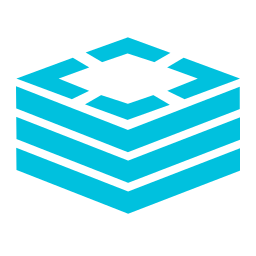
diagram.alibabacloud.database.apsaradb-postgresql.png|
diagram.alibabacloud.database.apsaradb-polardb.png|
diagram.alibabacloud.database.hybriddb-for-mysql.png|
diagram.alibabacloud.database.data-transmission-service.png|
diagram.alibabacloud.database.apsaradb-memcache.png|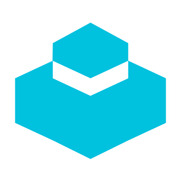
diagram.alibabacloud.database.database-backup-service.png|
diagram.alibabacloud.database.apsaradb-sqlserver.png|
diagram.alibabacloud.database.disribute-relational-database-service.png|
diagram.alibabacloud.database.apsaradb-cassandra.png|
diagram.alibabacloud.database.apsaradb-ppas.png|
diagram.alibabacloud.database.graph-database-service.png|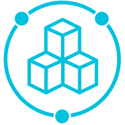
diagram.alibabacloud.database.apsaradb-oceanbase.png|
diagram.alibabacloud.database.relational-database-service.png|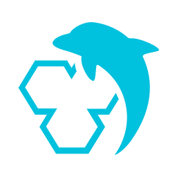
diagram.alibabacloud.database.apsaradb-hbase.png|
diagram.alibabacloud.database.data-management-service.png|
diagram.alibabacloud.database.apsaradb-mongodb.png|
diagram.alibabacloud.security.server-guard.png|
diagram.alibabacloud.security.bastion-host.png|
diagram.alibabacloud.security.security-center.png|
diagram.alibabacloud.security.ssl-certificates.png|
diagram.alibabacloud.security.content-moderation.png|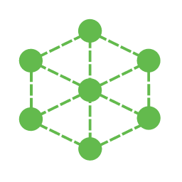
diagram.alibabacloud.security.anti-bot-service.png|
diagram.alibabacloud.security.crowdsourced-security-testing.png|
diagram.alibabacloud.security.id-verification.png|
diagram.alibabacloud.security.data-encryption-service.png|
diagram.alibabacloud.security.managed-security-service.png|
diagram.alibabacloud.security.anti-ddos-basic.png|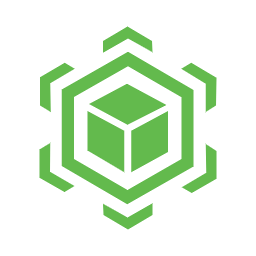
diagram.alibabacloud.security.web-application-firewall.png|
diagram.alibabacloud.security.cloud-security-scanner.png|
diagram.alibabacloud.security.game-shield.png|
diagram.alibabacloud.security.cloud-firewall.png|
diagram.alibabacloud.security.antifraud-service.png|
diagram.alibabacloud.security.anti-ddos-pro.png|
diagram.alibabacloud.security.db-audit.png|
diagram.alibabacloud.web.domain.png|
diagram.alibabacloud.web.dns.png|
diagram.alibabacloud.network.nat-gateway.png|
diagram.alibabacloud.network.express-connect.png|
diagram.alibabacloud.network.elastic-ip-address.png|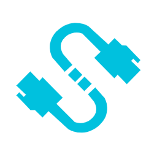
diagram.alibabacloud.network.virtual-private-cloud.png|
diagram.alibabacloud.network.server-load-balancer.png|
diagram.alibabacloud.network.cloud-enterprise-network.png|
diagram.alibabacloud.network.cdn.png|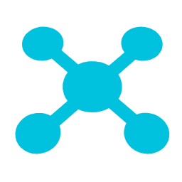
diagram.alibabacloud.network.smart-access-gateway.png|
diagram.alibabacloud.network.vpn-gateway.png|
diagram.alibabacloud.storage.hybrid-cloud-disaster-recovery.png|
diagram.alibabacloud.storage.object-table-store.png|
diagram.alibabacloud.storage.hybrid-backup-recovery.png|
diagram.alibabacloud.storage.object-storage-service.png|
diagram.alibabacloud.storage.imm.png|
diagram.alibabacloud.storage.file-storage-hdfs.png|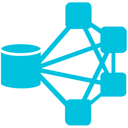
diagram.alibabacloud.storage.cloud-storage-gateway.png|
diagram.alibabacloud.storage.file-storage-nas.png|
diagram.alibabacloud.iot.iot-platform.png|
diagram.alibabacloud.iot.iot-internet-device-id.png|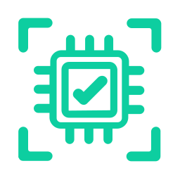
diagram.alibabacloud.iot.iot-link-wan.png|
diagram.alibabacloud.iot.iot-mobile-connection-package.png|
diagram.alibabacloud.compute.elastic-compute-service.png|
diagram.alibabacloud.compute.serverless-app-engine.png|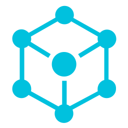
diagram.alibabacloud.compute.container-registry.png|
diagram.alibabacloud.compute.web-app-service.png|
diagram.alibabacloud.compute.batch-compute.png|
diagram.alibabacloud.compute.function-compute.png|
diagram.alibabacloud.compute.elastic-high-performance-computing.png|
diagram.alibabacloud.compute.elastic-container-instance.png|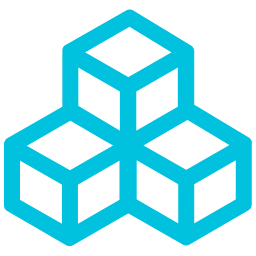
diagram.alibabacloud.compute.elastic-search.png|
diagram.alibabacloud.compute.container-service.png|
diagram.alibabacloud.compute.simple-application-server.png|
diagram.alibabacloud.compute.resource-orchestration-service.png|
diagram.alibabacloud.compute.auto-scaling.png|
diagram.alibabacloud.compute.operation-orchestration-service.png|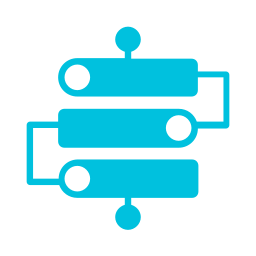
diagram.alibabacloud.compute.server-load-balancer.png|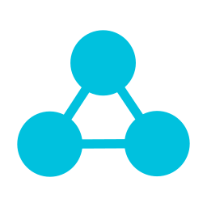
diagram.alibabacloud.application.rd-cloud.png|
diagram.alibabacloud.application.code-pipeline.png|
diagram.alibabacloud.application.blockchain-as-a-service.png|
diagram.alibabacloud.application.yida.png|
diagram.alibabacloud.application.smart-conversation-analysis.png|
diagram.alibabacloud.application.direct-mail.png|
diagram.alibabacloud.application.performance-testing-service.png|
diagram.alibabacloud.application.message-notification-service.png|
diagram.alibabacloud.application.api-gateway.png|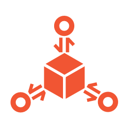
diagram.alibabacloud.application.open-search.png|
diagram.alibabacloud.application.node-js-performance-platform.png|
diagram.alibabacloud.application.bee-bot.png|
diagram.alibabacloud.application.cloud-call-center.png|
diagram.alibabacloud.application.log-service.png|
diagram.alibabacloud.communication.mobile-push.png|
diagram.alibabacloud.communication.direct-mail.png|
diagram.alibabacloud.analytics.data-lake-analytics.png|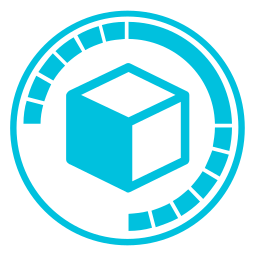
diagram.alibabacloud.analytics.analytic-db.png|
diagram.alibabacloud.analytics.elatic-map-reduce.png|
diagram.alibabacloud.analytics.open-search.png|
diagram.alibabacloud.analytics.click-house.png|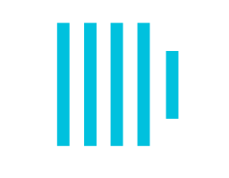
