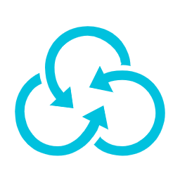

alibabacloud

Type | Name | Icon
--|--|--
database|apsaradb-redis.png|
database|apsaradb-postgresql.png|
database|apsaradb-polardb.png|
database|hybriddb-for-mysql.png|
database|data-transmission-service.png|
database|apsaradb-memcache.png|
database|database-backup-service.png|
database|apsaradb-sqlserver.png|
database|disribute-relational-database-service.png|
database|apsaradb-cassandra.png|
database|apsaradb-ppas.png|
database|graph-database-service.png|
database|apsaradb-oceanbase.png|
database|relational-database-service.png|
database|apsaradb-hbase.png|
database|data-management-service.png|
database|apsaradb-mongodb.png|
security|server-guard.png|
security|bastion-host.png|
security|security-center.png|
security|ssl-certificates.png|
security|content-moderation.png|
security|anti-bot-service.png|
security|crowdsourced-security-testing.png|
security|id-verification.png|
security|data-encryption-service.png|
security|managed-security-service.png|
security|anti-ddos-basic.png|
security|web-application-firewall.png|
security|cloud-security-scanner.png|
security|game-shield.png|
security|cloud-firewall.png|
security|antifraud-service.png|
security|anti-ddos-pro.png|
security|db-audit.png|
web|domain.png|
web|dns.png|
network|nat-gateway.png|
network|express-connect.png|
network|elastic-ip-address.png|
network|virtual-private-cloud.png|
network|server-load-balancer.png|
network|cloud-enterprise-network.png|
network|cdn.png|
network|smart-access-gateway.png|
network|vpn-gateway.png|
storage|hybrid-cloud-disaster-recovery.png|
storage|object-table-store.png|
storage|hybrid-backup-recovery.png|
storage|object-storage-service.png|
storage|imm.png|
storage|file-storage-hdfs.png|
storage|cloud-storage-gateway.png|
storage|file-storage-nas.png|
iot|iot-platform.png|
iot|iot-internet-device-id.png|
iot|iot-link-wan.png|
iot|iot-mobile-connection-package.png|
compute|elastic-compute-service.png|
compute|serverless-app-engine.png|
compute|container-registry.png|
compute|web-app-service.png|
compute|batch-compute.png|
compute|function-compute.png|
compute|elastic-high-performance-computing.png|
compute|elastic-container-instance.png|
compute|elastic-search.png|
compute|container-service.png|
compute|simple-application-server.png|
compute|resource-orchestration-service.png|
compute|auto-scaling.png|
compute|operation-orchestration-service.png|
compute|server-load-balancer.png|
application|rd-cloud.png|
application|code-pipeline.png|
application|blockchain-as-a-service.png|
application|yida.png|
application|smart-conversation-analysis.png|
application|direct-mail.png|
application|performance-testing-service.png|
application|message-notification-service.png|
application|api-gateway.png|
application|open-search.png|
application|node-js-performance-platform.png|
application|bee-bot.png|
application|cloud-call-center.png|
application|log-service.png|
communication|mobile-push.png|
communication|direct-mail.png|
analytics|data-lake-analytics.png|
analytics|analytic-db.png|
analytics|elatic-map-reduce.png|
analytics|open-search.png|
analytics|click-house.png|
