# aws

Namespace | Name | Icon
--|--|--
diagram.aws.database.quantum-ledger-database-qldb.png|
diagram.aws.database.redshift.png|
diagram.aws.database.dynamodb.png|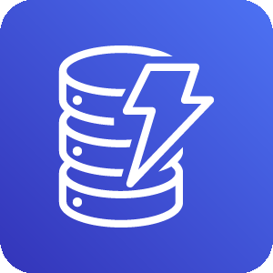
diagram.aws.database.dynamodb-table.png|
diagram.aws.database.database.png|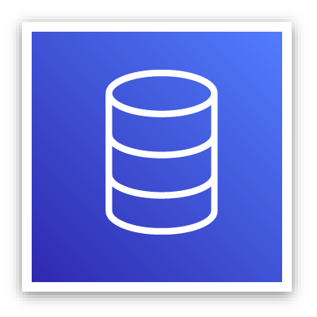
diagram.aws.database.database-migration-service.png|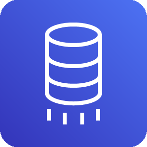
diagram.aws.database.aurora.png|
diagram.aws.database.timestream.png|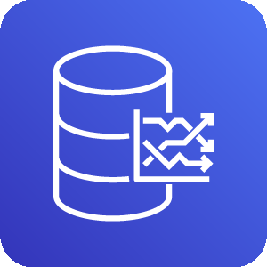
diagram.aws.database.dynamodb-global-secondary-index.png|
diagram.aws.database.dynamodb-dax.png|
diagram.aws.database.neptune.png|
diagram.aws.database.rds.png|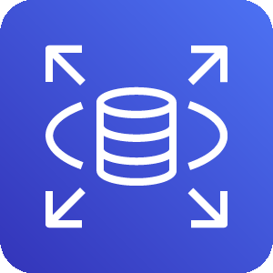
diagram.aws.database.documentdb-mongodb-compatibility.png|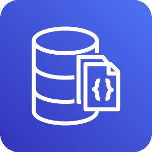
diagram.aws.database.rds-on-vmware.png|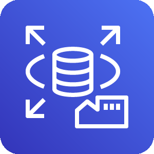
diagram.aws.database.elasticache.png|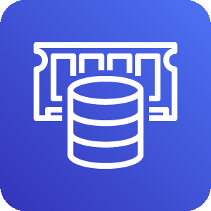
diagram.aws.security.security-hub.png|
diagram.aws.security.waf.png|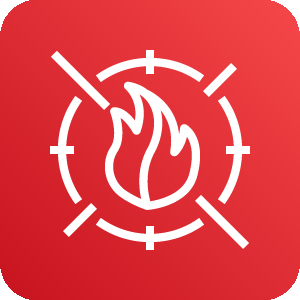
diagram.aws.security.shield.png|
diagram.aws.security.cloud-directory.png|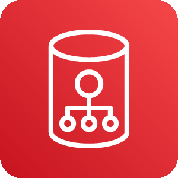
diagram.aws.security.identity-and-access-management-iam-role.png|
diagram.aws.security.identity-and-access-management-iam-permissions.png|
diagram.aws.security.detective.png|
diagram.aws.security.inspector.png|
diagram.aws.security.single-sign-on.png|
diagram.aws.security.secrets-manager.png|
diagram.aws.security.artifact.png|
diagram.aws.security.identity-and-access-management-iam.png|
diagram.aws.security.cognito.png|
diagram.aws.security.directory-service.png|
diagram.aws.security.key-management-service.png|
diagram.aws.security.identity-and-access-management-iam-aws-sts.png|
diagram.aws.security.resource-access-manager.png|
diagram.aws.security.firewall-manager.png|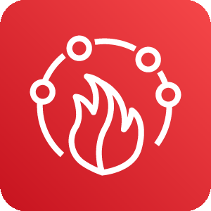
diagram.aws.security.guardduty.png|
diagram.aws.security.certificate-manager.png|
diagram.aws.security.identity-and-access-management-iam-access-analyzer.png|
diagram.aws.security.security-identity-and-compliance.png|
diagram.aws.security.macie.png|
diagram.aws.security.cloudhsm.png|
diagram.aws.general.generic-office-building.png|
diagram.aws.general.traditional-server.png|
diagram.aws.general.generic-firewall.png|
diagram.aws.general.generic-database.png|
diagram.aws.general.user.png|
diagram.aws.general.users.png|
diagram.aws.general.generic-saml-token.png|
diagram.aws.general.marketplace.png|
diagram.aws.general.general.png|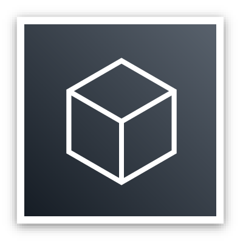
diagram.aws.general.disk.png|
diagram.aws.general.generic-sdk.png|
diagram.aws.integration.application-integration.png|
diagram.aws.integration.mq.png|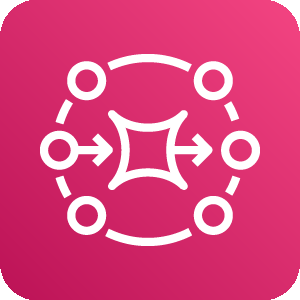
diagram.aws.integration.step-functions.png|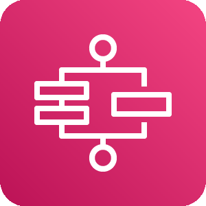
diagram.aws.integration.appsync.png|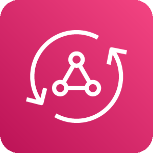
diagram.aws.integration.eventbridge.png|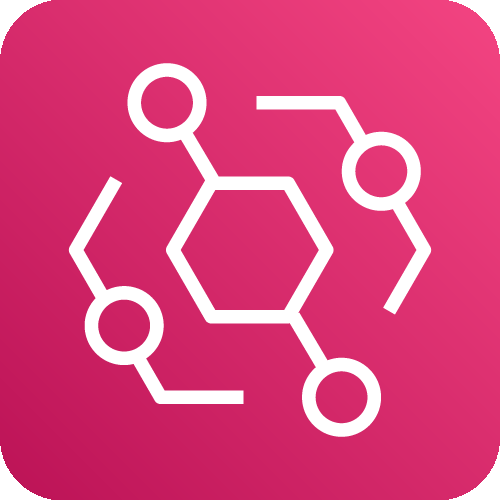
diagram.aws.integration.console-mobile-application.png|
diagram.aws.integration.simple-notification-service-sns.png|
diagram.aws.integration.simple-queue-service-sqs.png|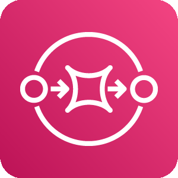
diagram.aws.enduser.workspaces.png|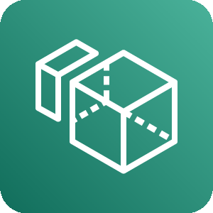
diagram.aws.enduser.worklink.png|
diagram.aws.enduser.appstream-2-0.png|
diagram.aws.enduser.workdocs.png|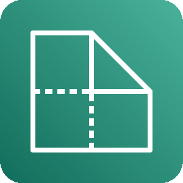
diagram.aws.robotics.robomaker-simulator.png|
diagram.aws.robotics.robomaker.png|
diagram.aws.robotics.robotics.png|
diagram.aws.network.networking-and-content-delivery.png|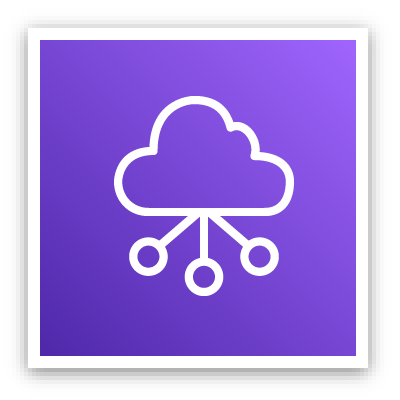
diagram.aws.network.vpc-peering.png|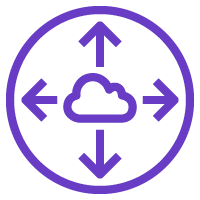
diagram.aws.network.nat-gateway.png|
diagram.aws.network.site-to-site-vpn.png|
diagram.aws.network.route-53.png|
diagram.aws.network.internet-gateway.png|
diagram.aws.network.cloudfront.png|
diagram.aws.network.elastic-load-balancing.png|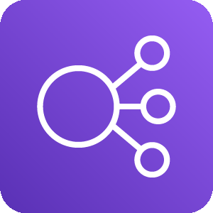
diagram.aws.network.vpc-router.png|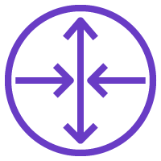
diagram.aws.network.app-mesh.png|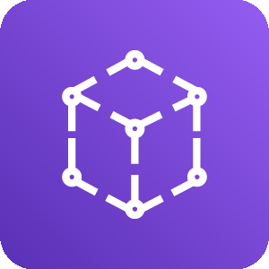
diagram.aws.network.transit-gateway.png|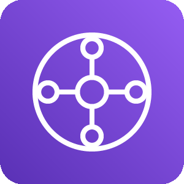
diagram.aws.network.global-accelerator.png|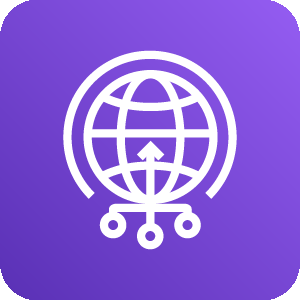
diagram.aws.network.privatelink.png|
diagram.aws.network.direct-connect.png|
diagram.aws.network.private-subnet.png|
diagram.aws.network.cloud-map.png|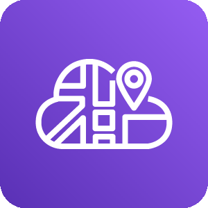
diagram.aws.network.route-table.png|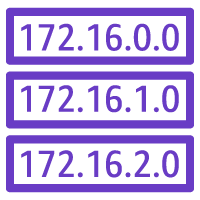
diagram.aws.network.endpoint.png|
diagram.aws.network.api-gateway.png|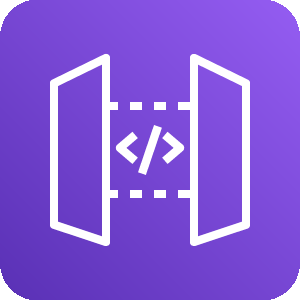
diagram.aws.network.nacl.png|
diagram.aws.network.public-subnet.png|
diagram.aws.network.client-vpn.png|
diagram.aws.network.vpc.png|
diagram.aws.cost.savings-plans.png|
diagram.aws.cost.cost-and-usage-report.png|
diagram.aws.cost.reserved-instance-reporting.png|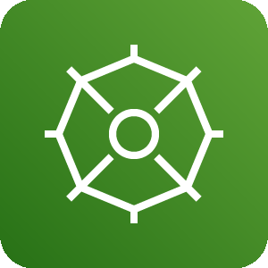
diagram.aws.cost.budgets.png|
diagram.aws.cost.cost-explorer.png|
diagram.aws.business.alexa-for-business.png|
diagram.aws.business.workmail.png|
diagram.aws.business.chime.png|
diagram.aws.management.managed-services.png|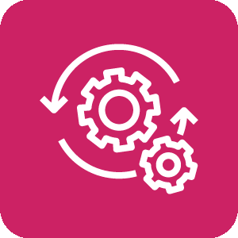
diagram.aws.management.command-line-interface.png|
diagram.aws.management.trusted-advisor.png|
diagram.aws.management.license-manager.png|
diagram.aws.management.opsworks.png|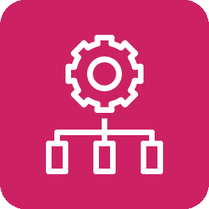
diagram.aws.management.config.png|
diagram.aws.management.codeguru.png|
diagram.aws.management.auto-scaling.png|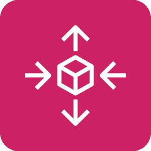
diagram.aws.management.systems-manager.png|
diagram.aws.management.organizations.png|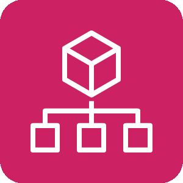
diagram.aws.management.control-tower.png|
diagram.aws.management.management-console.png|
diagram.aws.management.cloudtrail.png|
diagram.aws.management.cloudwatch.png|
diagram.aws.management.systems-manager-parameter-store.png|
diagram.aws.management.service-catalog.png|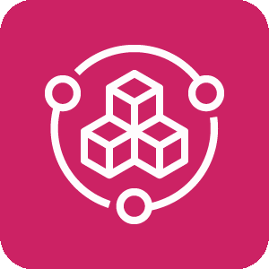
diagram.aws.management.cloudformation.png|
diagram.aws.management.well-architected-tool.png|
diagram.aws.game.gamelift.png|
diagram.aws.storage.fsx-for-windows-file-server.png|
diagram.aws.storage.cloudendure-disaster-recovery.png|
diagram.aws.storage.efs-infrequentaccess-primary-bg.png|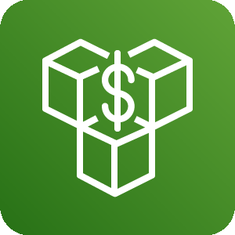
diagram.aws.storage.simple-storage-service-s3.png|
diagram.aws.storage.snowball.png|
diagram.aws.storage.efs-standard-primary-bg.png|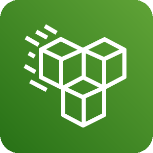
diagram.aws.storage.fsx.png|
diagram.aws.storage.storage-gateway.png|
diagram.aws.storage.backup.png|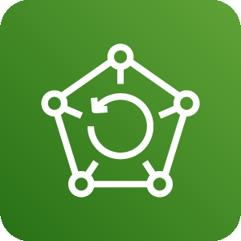
diagram.aws.storage.snowball-edge.png|
diagram.aws.storage.snowmobile.png|
diagram.aws.storage.elastic-block-store-ebs.png|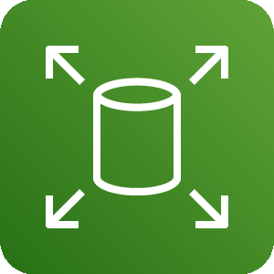
diagram.aws.storage.fsx-for-lustre.png|
diagram.aws.storage.s3-glacier.png|
diagram.aws.storage.storage.png|
diagram.aws.storage.elastic-file-system-efs.png|
diagram.aws.iot.iot-rule.png|
diagram.aws.iot.iot-events.png|
diagram.aws.iot.internet-of-things.png|
diagram.aws.iot.freertos.png|
diagram.aws.iot.iot-http2.png|
diagram.aws.iot.iot-alexa-echo.png|
diagram.aws.iot.iot-policy.png|
diagram.aws.iot.iot-action.png|
diagram.aws.iot.iot-http.png|
diagram.aws.iot.iot-policy-emergency.png|
diagram.aws.iot.iot-greengrass-connector.png|
diagram.aws.iot.iot-things-graph.png|
diagram.aws.iot.iot-jobs.png|
diagram.aws.iot.iot-button.png|
diagram.aws.iot.iot-topic.png|
diagram.aws.iot.iot-camera.png|
diagram.aws.iot.iot-1-click.png|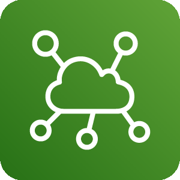
diagram.aws.iot.iot-hardware-board.png|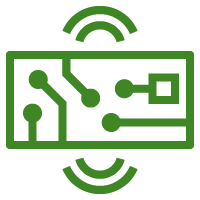
diagram.aws.iot.iot-shadow.png|
diagram.aws.iot.iot-device-management.png|
diagram.aws.iot.iot-alexa-skill.png|
diagram.aws.iot.iot-device-defender.png|
diagram.aws.iot.iot-sitewise.png|
diagram.aws.iot.iot-core.png|
diagram.aws.iot.iot-lambda.png|
diagram.aws.iot.iot-greengrass.png|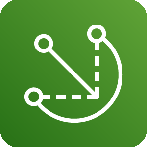
diagram.aws.iot.iot-mqtt.png|
diagram.aws.iot.iot-certificate.png|
diagram.aws.iot.iot-analytics.png|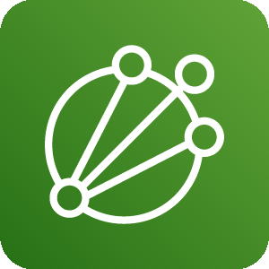
diagram.aws.engagement.pinpoint.png|
diagram.aws.engagement.connect.png|
diagram.aws.engagement.simple-email-service-ses.png|
diagram.aws.blockchain.quantum-ledger-database-qldb.png|
diagram.aws.blockchain.managed-blockchain.png|
diagram.aws.compute.batch.png|
diagram.aws.compute.elastic-kubernetes-service.png|
diagram.aws.compute.compute.png|
diagram.aws.compute.elastic-beanstalk-rounded.png|
diagram.aws.compute.thinkbox-frost.png|
diagram.aws.compute.ec2-container-registry-rounded.png|
diagram.aws.compute.thinkbox-deadline-rounded.png|
diagram.aws.compute.thinkbox-stoke-rounded.png|
diagram.aws.compute.compute-rounded.png|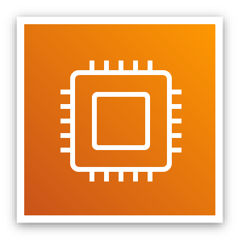
diagram.aws.compute.thinkbox-stoke.png|
diagram.aws.compute.ec2-rounded.png|
diagram.aws.compute.thinkbox-draft-rounded.png|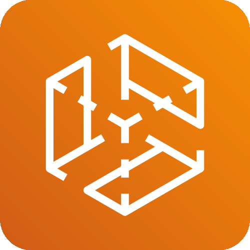
diagram.aws.compute.ec2-container-registry.png|
diagram.aws.compute.ec2.png|
diagram.aws.compute.batch-rounded.png|
diagram.aws.compute.thinkbox-deadline.png|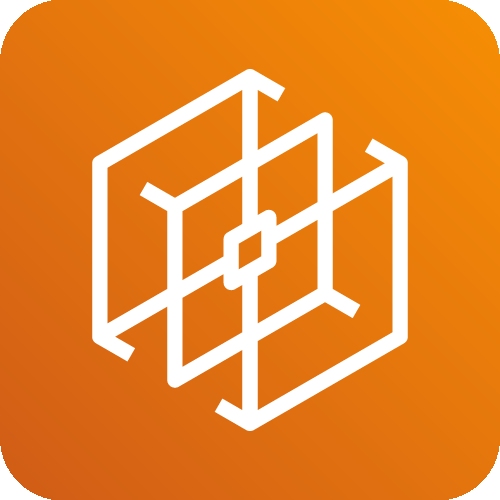
diagram.aws.compute.fargate.png|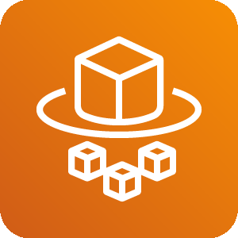
diagram.aws.compute.thinkbox-krakatoa-rounded.png|
diagram.aws.compute.outposts.png|
diagram.aws.compute.application-auto-scaling-rounded.png|
diagram.aws.compute.elastic-container-service-rounded.png|
diagram.aws.compute.elastic-kubernetes-service-rounded.png|
diagram.aws.compute.lambda-rounded.png|
diagram.aws.compute.thinkbox-draft.png|
diagram.aws.compute.thinkbox-frost-rounded.png|
diagram.aws.compute.fargate-rounded.png|
diagram.aws.compute.vmware-cloud-on-aws.png|
diagram.aws.compute.thinkbox-xmesh-rounded.png|
diagram.aws.compute.thinkbox-xmesh.png|
diagram.aws.compute.lambda.png|
diagram.aws.compute.vmware-cloud-on-aws-rounded.png|
diagram.aws.compute.outposts-rounded.png|
diagram.aws.compute.thinkbox-krakatoa.png|
diagram.aws.compute.thinkbox-sequoia-rounded.png|
diagram.aws.compute.elastic-container-service.png|
diagram.aws.compute.lightsail-rounded.png|
diagram.aws.compute.application-auto-scaling.png|
diagram.aws.compute.serverless-application-repository-rounded.png|
diagram.aws.compute.serverless-application-repository.png|
diagram.aws.compute.elastic-beanstalk.png|
diagram.aws.compute.thinkbox-sequoia.png|
diagram.aws.compute.lightsail.png|
diagram.aws.devtools.x-ray.png|
diagram.aws.devtools.command-line-interface.png|
diagram.aws.devtools.tools-and-sdks.png|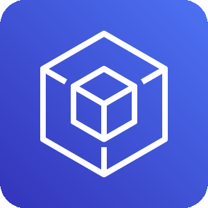
diagram.aws.devtools.codepipeline.png|
diagram.aws.devtools.codebuild.png|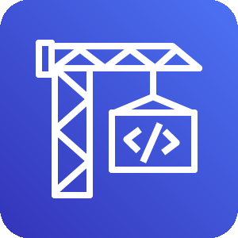
diagram.aws.devtools.cloud9.png|
diagram.aws.devtools.cloud-development-kit.png|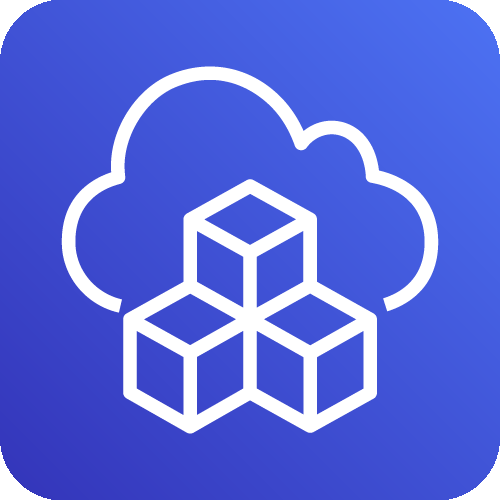
diagram.aws.devtools.codestar.png|
diagram.aws.devtools.developer-tools.png|
diagram.aws.devtools.codecommit.png|
diagram.aws.devtools.codedeploy.png|
diagram.aws.ml.deepracer.png|
diagram.aws.ml.sagemaker.png|
diagram.aws.ml.sagemaker-ground-truth.png|
diagram.aws.ml.polly.png|
diagram.aws.ml.transcribe.png|
diagram.aws.ml.machine-learning.png|
diagram.aws.ml.rekognition.png|
diagram.aws.ml.lex.png|
diagram.aws.ml.sagemaker-model.png|
diagram.aws.ml.sagemaker-notebook.png|
diagram.aws.ml.deeplens.png|
diagram.aws.ml.tensorflow-on-aws.png|
diagram.aws.ml.deep-learning-containers.png|
diagram.aws.ml.translate.png|
diagram.aws.ml.textract.png|
diagram.aws.ml.deep-learning-amis.png|
diagram.aws.ml.comprehend.png|
diagram.aws.ml.personalize.png|
diagram.aws.ml.apache-mxnet-on-aws.png|
diagram.aws.ml.sagemaker-training-job.png|
diagram.aws.ml.forecast.png|
diagram.aws.ml.elastic-inference.png|
diagram.aws.mobile.pinpoint.png|
diagram.aws.mobile.appsync.png|
diagram.aws.mobile.api-gateway-endpoint.png|
diagram.aws.mobile.amplify.png|
diagram.aws.mobile.api-gateway.png|
diagram.aws.mobile.device-farm.png|
diagram.aws.ar.sumerian.png|
diagram.aws.satellite.ground-station.png|
diagram.aws.migration.server-migration-service.png|
diagram.aws.migration.application-discovery-service.png|
diagram.aws.migration.transfer-for-sftp.png|
diagram.aws.migration.migration-and-transfer.png|
diagram.aws.migration.datasync.png|
diagram.aws.migration.database-migration-service.png|
diagram.aws.migration.snowball.png|
diagram.aws.migration.cloudendure-migration.png|
diagram.aws.migration.migration-hub.png|
diagram.aws.migration.snowball-edge.png|
diagram.aws.migration.snowmobile.png|
diagram.aws.enablement.managed-services.png|
diagram.aws.enablement.support.png|
diagram.aws.enablement.iq.png|
diagram.aws.enablement.professional-services.png|
diagram.aws.analytics.kinesis-video-streams.png|
diagram.aws.analytics.redshift-dense-compute-node.png|
diagram.aws.analytics.redshift.png|
diagram.aws.analytics.athena.png|
diagram.aws.analytics.data-pipeline.png|
diagram.aws.analytics.glue-crawlers.png|
diagram.aws.analytics.emr-hdfs-cluster.png|
diagram.aws.analytics.elasticsearch-service.png|
diagram.aws.analytics.kinesis-data-streams.png|
diagram.aws.analytics.kinesis-data-firehose.png|
diagram.aws.analytics.emr-cluster.png|
diagram.aws.analytics.emr.png|
diagram.aws.analytics.quicksight.png|
diagram.aws.analytics.cloudsearch-search-documents.png|
diagram.aws.analytics.glue.png|
diagram.aws.analytics.kinesis-data-analytics.png|
diagram.aws.analytics.redshift-dense-storage-node.png|
diagram.aws.analytics.managed-streaming-for-kafka.png|
diagram.aws.analytics.glue-data-catalog.png|
diagram.aws.analytics.analytics.png|
diagram.aws.analytics.kinesis.png|
diagram.aws.analytics.lake-formation.png|
diagram.aws.analytics.cloudsearch.png|
diagram.aws.quantum.braket.png|
diagram.aws.media.elemental-live.png|
diagram.aws.media.elemental-mediaconvert.png|
diagram.aws.media.elemental-mediastore.png|
diagram.aws.media.elemental-mediatailor.png|
diagram.aws.media.elemental-delta.png|
diagram.aws.media.elemental-conductor.png|
diagram.aws.media.elemental-server.png|
diagram.aws.media.elemental-medialive.png|
diagram.aws.media.elemental-mediapackage.png|
diagram.aws.media.elastic-transcoder.png|
diagram.aws.media.elemental-mediaconnect.png|
