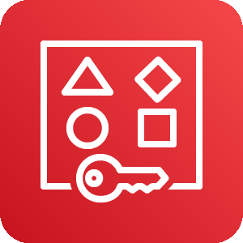
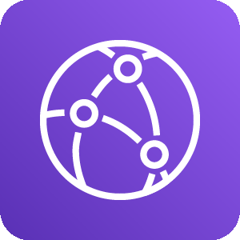
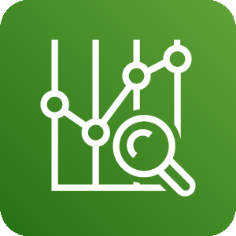
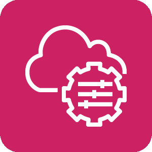
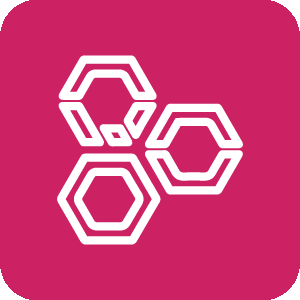
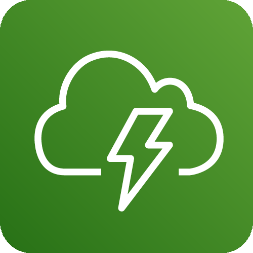
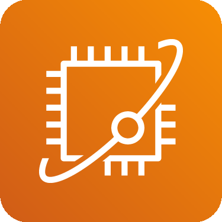
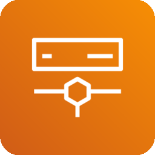
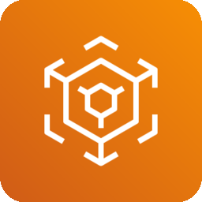

aws

Type | Name | Icon
--|--|--
database|quantum-ledger-database-qldb.png|
database|redshift.png|
database|dynamodb.png|
database|dynamodb-table.png|
database|database.png|
database|database-migration-service.png|
database|aurora.png|
database|timestream.png|
database|dynamodb-global-secondary-index.png|
database|dynamodb-dax.png|
database|neptune.png|
database|rds.png|
database|documentdb-mongodb-compatibility.png|
database|rds-on-vmware.png|
database|elasticache.png|
security|security-hub.png|
security|waf.png|
security|shield.png|
security|cloud-directory.png|
security|identity-and-access-management-iam-role.png|
security|identity-and-access-management-iam-permissions.png|
security|detective.png|
security|inspector.png|
security|single-sign-on.png|
security|secrets-manager.png|
security|artifact.png|
security|identity-and-access-management-iam.png|
security|cognito.png|
security|directory-service.png|
security|key-management-service.png|
security|identity-and-access-management-iam-aws-sts.png|
security|resource-access-manager.png|
security|firewall-manager.png|
security|guardduty.png|
security|certificate-manager.png|
security|identity-and-access-management-iam-access-analyzer.png|
security|security-identity-and-compliance.png|
security|macie.png|
security|cloudhsm.png|
general|generic-office-building.png|
general|traditional-server.png|
general|generic-firewall.png|
general|generic-database.png|
general|user.png|
general|users.png|
general|generic-saml-token.png|
general|marketplace.png|
general|general.png|
general|disk.png|
general|generic-sdk.png|
integration|application-integration.png|
integration|mq.png|
integration|step-functions.png|
integration|appsync.png|
integration|eventbridge.png|
integration|console-mobile-application.png|
integration|simple-notification-service-sns.png|
integration|simple-queue-service-sqs.png|
enduser|workspaces.png|
enduser|worklink.png|
enduser|appstream-2-0.png|
enduser|workdocs.png|
robotics|robomaker-simulator.png|
robotics|robomaker.png|
robotics|robotics.png|
network|networking-and-content-delivery.png|
network|vpc-peering.png|
network|nat-gateway.png|
network|site-to-site-vpn.png|
network|route-53.png|
network|internet-gateway.png|
network|cloudfront.png|
network|elastic-load-balancing.png|
network|vpc-router.png|
network|app-mesh.png|
network|transit-gateway.png|
network|global-accelerator.png|
network|privatelink.png|
network|direct-connect.png|
network|private-subnet.png|
network|cloud-map.png|
network|route-table.png|
network|endpoint.png|
network|api-gateway.png|
network|nacl.png|
network|public-subnet.png|
network|client-vpn.png|
network|vpc.png|
cost|savings-plans.png|
cost|cost-and-usage-report.png|
cost|reserved-instance-reporting.png|
cost|budgets.png|
cost|cost-explorer.png|
business|alexa-for-business.png|
business|workmail.png|
business|chime.png|
management|managed-services.png|
management|command-line-interface.png|
management|trusted-advisor.png|
management|license-manager.png|
management|opsworks.png|
management|config.png|
management|codeguru.png|
management|auto-scaling.png|
management|systems-manager.png|
management|organizations.png|
management|control-tower.png|
management|management-console.png|
management|cloudtrail.png|
management|cloudwatch.png|
management|systems-manager-parameter-store.png|
management|service-catalog.png|
management|cloudformation.png|
management|well-architected-tool.png|
game|gamelift.png|
storage|fsx-for-windows-file-server.png|
storage|cloudendure-disaster-recovery.png|
storage|efs-infrequentaccess-primary-bg.png|
storage|simple-storage-service-s3.png|
storage|snowball.png|
storage|efs-standard-primary-bg.png|
storage|fsx.png|
storage|storage-gateway.png|
storage|backup.png|
storage|snowball-edge.png|
storage|snowmobile.png|
storage|elastic-block-store-ebs.png|
storage|fsx-for-lustre.png|
storage|s3-glacier.png|
storage|storage.png|
storage|elastic-file-system-efs.png|
iot|iot-rule.png|
iot|iot-events.png|
iot|internet-of-things.png|
iot|freertos.png|
iot|iot-http2.png|
iot|iot-alexa-echo.png|
iot|iot-policy.png|
iot|iot-action.png|
iot|iot-http.png|
iot|iot-policy-emergency.png|
iot|iot-greengrass-connector.png|
iot|iot-things-graph.png|
iot|iot-jobs.png|
iot|iot-button.png|
iot|iot-topic.png|
iot|iot-camera.png|
iot|iot-1-click.png|
iot|iot-hardware-board.png|
iot|iot-shadow.png|
iot|iot-device-management.png|
iot|iot-alexa-skill.png|
iot|iot-device-defender.png|
iot|iot-sitewise.png|
iot|iot-core.png|
iot|iot-lambda.png|
iot|iot-greengrass.png|
iot|iot-mqtt.png|
iot|iot-certificate.png|
iot|iot-analytics.png|
engagement|pinpoint.png|
engagement|connect.png|
engagement|simple-email-service-ses.png|
blockchain|quantum-ledger-database-qldb.png|
blockchain|managed-blockchain.png|
compute|batch.png|
compute|elastic-kubernetes-service.png|
compute|compute.png|
compute|elastic-beanstalk-rounded.png|
compute|thinkbox-frost.png|
compute|ec2-container-registry-rounded.png|
compute|thinkbox-deadline-rounded.png|
compute|thinkbox-stoke-rounded.png|
compute|compute-rounded.png|
compute|thinkbox-stoke.png|
compute|ec2-rounded.png|
compute|thinkbox-draft-rounded.png|
compute|ec2-container-registry.png|
compute|ec2.png|
compute|batch-rounded.png|
compute|thinkbox-deadline.png|
compute|fargate.png|
compute|thinkbox-krakatoa-rounded.png|
compute|outposts.png|
compute|application-auto-scaling-rounded.png|
compute|elastic-container-service-rounded.png|
compute|elastic-kubernetes-service-rounded.png|
compute|lambda-rounded.png|
compute|thinkbox-draft.png|
compute|thinkbox-frost-rounded.png|
compute|fargate-rounded.png|
compute|vmware-cloud-on-aws.png|
compute|thinkbox-xmesh-rounded.png|
compute|thinkbox-xmesh.png|
compute|lambda.png|
compute|vmware-cloud-on-aws-rounded.png|
compute|outposts-rounded.png|
compute|thinkbox-krakatoa.png|
compute|thinkbox-sequoia-rounded.png|
compute|elastic-container-service.png|
compute|lightsail-rounded.png|
compute|application-auto-scaling.png|
compute|serverless-application-repository-rounded.png|
compute|serverless-application-repository.png|
compute|elastic-beanstalk.png|
compute|thinkbox-sequoia.png|
compute|lightsail.png|
devtools|x-ray.png|
devtools|command-line-interface.png|
devtools|tools-and-sdks.png|
devtools|codepipeline.png|
devtools|codebuild.png|
devtools|cloud9.png|
devtools|cloud-development-kit.png|
devtools|codestar.png|
devtools|developer-tools.png|
devtools|codecommit.png|
devtools|codedeploy.png|
ml|deepracer.png|
ml|sagemaker.png|
ml|sagemaker-ground-truth.png|
ml|polly.png|
ml|transcribe.png|
ml|machine-learning.png|
ml|rekognition.png|
ml|lex.png|
ml|sagemaker-model.png|
ml|sagemaker-notebook.png|
ml|deeplens.png|
ml|tensorflow-on-aws.png|
ml|deep-learning-containers.png|
ml|translate.png|
ml|textract.png|
ml|deep-learning-amis.png|
ml|comprehend.png|
ml|personalize.png|
ml|apache-mxnet-on-aws.png|
ml|sagemaker-training-job.png|
ml|forecast.png|
ml|elastic-inference.png|
mobile|pinpoint.png|
mobile|appsync.png|
mobile|api-gateway-endpoint.png|
mobile|amplify.png|
mobile|api-gateway.png|
mobile|device-farm.png|
ar|sumerian.png|
satellite|ground-station.png|
migration|server-migration-service.png|
migration|application-discovery-service.png|
migration|transfer-for-sftp.png|
migration|migration-and-transfer.png|
migration|datasync.png|
migration|database-migration-service.png|
migration|snowball.png|
migration|cloudendure-migration.png|
migration|migration-hub.png|
migration|snowball-edge.png|
migration|snowmobile.png|
enablement|managed-services.png|
enablement|support.png|
enablement|iq.png|
enablement|professional-services.png|
analytics|kinesis-video-streams.png|
analytics|redshift-dense-compute-node.png|
analytics|redshift.png|
analytics|athena.png|
analytics|data-pipeline.png|
analytics|glue-crawlers.png|
analytics|emr-hdfs-cluster.png|
analytics|elasticsearch-service.png|
analytics|kinesis-data-streams.png|
analytics|kinesis-data-firehose.png|
analytics|emr-cluster.png|
analytics|emr.png|
analytics|quicksight.png|
analytics|cloudsearch-search-documents.png|
analytics|glue.png|
analytics|kinesis-data-analytics.png|
analytics|redshift-dense-storage-node.png|
analytics|managed-streaming-for-kafka.png|
analytics|glue-data-catalog.png|
analytics|analytics.png|
analytics|kinesis.png|
analytics|lake-formation.png|
analytics|cloudsearch.png|
quantum|braket.png|
media|elemental-live.png|
media|elemental-mediaconvert.png|
media|elemental-mediastore.png|
media|elemental-mediatailor.png|
media|elemental-delta.png|
media|elemental-conductor.png|
media|elemental-server.png|
media|elemental-medialive.png|
media|elemental-mediapackage.png|
media|elastic-transcoder.png|
media|elemental-mediaconnect.png|
