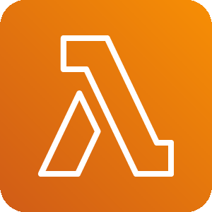
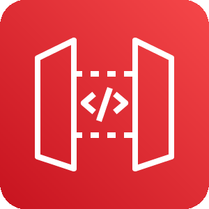

# aws

Namespace | Name | Icon
--|--|--
`diagram.aws.database`|QuantumLedgerDatabaseQldb|
`diagram.aws.database`|Redshift|
`diagram.aws.database`|Dynamodb|
`diagram.aws.database`|DynamodbTable|
`diagram.aws.database`|Database|
`diagram.aws.database`|DatabaseMigrationService|
`diagram.aws.database`|Aurora|
`diagram.aws.database`|Timestream|
`diagram.aws.database`|DynamodbGlobalSecondaryIndex|
`diagram.aws.database`|DynamodbDax|
`diagram.aws.database`|Neptune|
`diagram.aws.database`|Rds|
`diagram.aws.database`|DocumentdbMongodbCompatibility|
`diagram.aws.database`|RdsOnVmware|
`diagram.aws.database`|Elasticache|
`diagram.aws.security`|SecurityHub|
`diagram.aws.security`|Waf|
`diagram.aws.security`|Shield|
`diagram.aws.security`|CloudDirectory|
`diagram.aws.security`|IdentityAndAccessManagementIamRole|
`diagram.aws.security`|IdentityAndAccessManagementIamPermissions|
`diagram.aws.security`|Detective|
`diagram.aws.security`|Inspector|
`diagram.aws.security`|SingleSignOn|
`diagram.aws.security`|SecretsManager|
`diagram.aws.security`|Artifact|
`diagram.aws.security`|IdentityAndAccessManagementIam|
`diagram.aws.security`|Cognito|
`diagram.aws.security`|DirectoryService|
`diagram.aws.security`|KeyManagementService|
`diagram.aws.security`|IdentityAndAccessManagementIamAwsSts|
`diagram.aws.security`|ResourceAccessManager|
`diagram.aws.security`|FirewallManager|
`diagram.aws.security`|Guardduty|
`diagram.aws.security`|CertificateManager|
`diagram.aws.security`|IdentityAndAccessManagementIamAccessAnalyzer|
`diagram.aws.security`|SecurityIdentityAndCompliance|
`diagram.aws.security`|Macie|
`diagram.aws.security`|Cloudhsm|
`diagram.aws.general`|GenericOfficeBuilding|
`diagram.aws.general`|TraditionalServer|
`diagram.aws.general`|GenericFirewall|
`diagram.aws.general`|GenericDatabase|
`diagram.aws.general`|User|
`diagram.aws.general`|Users|
`diagram.aws.general`|GenericSamlToken|
`diagram.aws.general`|Marketplace|
`diagram.aws.general`|General|
`diagram.aws.general`|Disk|
`diagram.aws.general`|GenericSdk|
`diagram.aws.integration`|ApplicationIntegration|
`diagram.aws.integration`|Mq|
`diagram.aws.integration`|StepFunctions|
`diagram.aws.integration`|Appsync|
`diagram.aws.integration`|Eventbridge|
`diagram.aws.integration`|ConsoleMobileApplication|
`diagram.aws.integration`|SimpleNotificationServiceSns|
`diagram.aws.integration`|SimpleQueueServiceSqs|
`diagram.aws.enduser`|Workspaces|
`diagram.aws.enduser`|Worklink|
`diagram.aws.enduser`|Appstream20|
`diagram.aws.enduser`|Workdocs|
`diagram.aws.robotics`|RobomakerSimulator|
`diagram.aws.robotics`|Robomaker|
`diagram.aws.robotics`|Robotics|
`diagram.aws.network`|NetworkingAndContentDelivery|
`diagram.aws.network`|VpcPeering|
`diagram.aws.network`|NatGateway|
`diagram.aws.network`|SiteToSiteVpn|
`diagram.aws.network`|Route53|
`diagram.aws.network`|InternetGateway|
`diagram.aws.network`|Cloudfront|
`diagram.aws.network`|ElasticLoadBalancing|
`diagram.aws.network`|VpcRouter|
`diagram.aws.network`|AppMesh|
`diagram.aws.network`|TransitGateway|
`diagram.aws.network`|GlobalAccelerator|
`diagram.aws.network`|Privatelink|
`diagram.aws.network`|DirectConnect|
`diagram.aws.network`|PrivateSubnet|
`diagram.aws.network`|CloudMap|
`diagram.aws.network`|RouteTable|
`diagram.aws.network`|Endpoint|
`diagram.aws.network`|ApiGateway|
`diagram.aws.network`|Nacl|
`diagram.aws.network`|PublicSubnet|
`diagram.aws.network`|ClientVpn|
`diagram.aws.network`|Vpc|
`diagram.aws.cost`|SavingsPlans|
`diagram.aws.cost`|CostAndUsageReport|
`diagram.aws.cost`|ReservedInstanceReporting|
`diagram.aws.cost`|Budgets|
`diagram.aws.cost`|CostExplorer|
`diagram.aws.business`|AlexaForBusiness|
`diagram.aws.business`|Workmail|
`diagram.aws.business`|Chime|
`diagram.aws.management`|ManagedServices|
`diagram.aws.management`|CommandLineInterface|
`diagram.aws.management`|TrustedAdvisor|
`diagram.aws.management`|LicenseManager|
`diagram.aws.management`|Opsworks|
`diagram.aws.management`|Config|
`diagram.aws.management`|Codeguru|
`diagram.aws.management`|AutoScaling|
`diagram.aws.management`|SystemsManager|
`diagram.aws.management`|Organizations|
`diagram.aws.management`|ControlTower|
`diagram.aws.management`|ManagementConsole|
`diagram.aws.management`|Cloudtrail|
`diagram.aws.management`|Cloudwatch|
`diagram.aws.management`|SystemsManagerParameterStore|
`diagram.aws.management`|ServiceCatalog|
`diagram.aws.management`|Cloudformation|
`diagram.aws.management`|WellArchitectedTool|
`diagram.aws.game`|Gamelift|
`diagram.aws.storage`|FsxForWindowsFileServer|
`diagram.aws.storage`|CloudendureDisasterRecovery|
`diagram.aws.storage`|EfsInfrequentaccessPrimaryBg|
`diagram.aws.storage`|SimpleStorageServiceS3|
`diagram.aws.storage`|Snowball|
`diagram.aws.storage`|EfsStandardPrimaryBg|
`diagram.aws.storage`|Fsx|
`diagram.aws.storage`|StorageGateway|
`diagram.aws.storage`|Backup|
`diagram.aws.storage`|SnowballEdge|
`diagram.aws.storage`|Snowmobile|
`diagram.aws.storage`|ElasticBlockStoreEbs|
`diagram.aws.storage`|FsxForLustre|
`diagram.aws.storage`|S3Glacier|
`diagram.aws.storage`|Storage|
`diagram.aws.storage`|ElasticFileSystemEfs|
`diagram.aws.iot`|IotRule|
`diagram.aws.iot`|IotEvents|
`diagram.aws.iot`|InternetOfThings|
`diagram.aws.iot`|Freertos|
`diagram.aws.iot`|IotHttp2|
`diagram.aws.iot`|IotAlexaEcho|
`diagram.aws.iot`|IotPolicy|
`diagram.aws.iot`|IotAction|
`diagram.aws.iot`|IotHttp|
`diagram.aws.iot`|IotPolicyEmergency|
`diagram.aws.iot`|IotGreengrassConnector|
`diagram.aws.iot`|IotThingsGraph|
`diagram.aws.iot`|IotJobs|
`diagram.aws.iot`|IotButton|
`diagram.aws.iot`|IotTopic|
`diagram.aws.iot`|IotCamera|
`diagram.aws.iot`|Iot1Click|
`diagram.aws.iot`|IotHardwareBoard|
`diagram.aws.iot`|IotShadow|
`diagram.aws.iot`|IotDeviceManagement|
`diagram.aws.iot`|IotAlexaSkill|
`diagram.aws.iot`|IotDeviceDefender|
`diagram.aws.iot`|IotSitewise|
`diagram.aws.iot`|IotCore|
`diagram.aws.iot`|IotLambda|
`diagram.aws.iot`|IotGreengrass|
`diagram.aws.iot`|IotMqtt|
`diagram.aws.iot`|IotCertificate|
`diagram.aws.iot`|IotAnalytics|
`diagram.aws.engagement`|Pinpoint|
`diagram.aws.engagement`|Connect|
`diagram.aws.engagement`|SimpleEmailServiceSes|
`diagram.aws.blockchain`|QuantumLedgerDatabaseQldb|
`diagram.aws.blockchain`|ManagedBlockchain|
`diagram.aws.compute`|Batch|
`diagram.aws.compute`|ElasticKubernetesService|
`diagram.aws.compute`|Compute|
`diagram.aws.compute`|ElasticBeanstalkRounded|
`diagram.aws.compute`|ThinkboxFrost|
`diagram.aws.compute`|Ec2ContainerRegistryRounded|
`diagram.aws.compute`|ThinkboxDeadlineRounded|
`diagram.aws.compute`|ThinkboxStokeRounded|
`diagram.aws.compute`|ComputeRounded|
`diagram.aws.compute`|ThinkboxStoke|
`diagram.aws.compute`|Ec2Rounded|
`diagram.aws.compute`|ThinkboxDraftRounded|
`diagram.aws.compute`|Ec2ContainerRegistry|
`diagram.aws.compute`|Ec2|
`diagram.aws.compute`|BatchRounded|
`diagram.aws.compute`|ThinkboxDeadline|
`diagram.aws.compute`|Fargate|
`diagram.aws.compute`|ThinkboxKrakatoaRounded|
`diagram.aws.compute`|Outposts|
`diagram.aws.compute`|ApplicationAutoScalingRounded|
`diagram.aws.compute`|ElasticContainerServiceRounded|
`diagram.aws.compute`|ElasticKubernetesServiceRounded|
`diagram.aws.compute`|LambdaRounded|
`diagram.aws.compute`|ThinkboxDraft|
`diagram.aws.compute`|ThinkboxFrostRounded|
`diagram.aws.compute`|FargateRounded|
`diagram.aws.compute`|VmwareCloudOnAws|
`diagram.aws.compute`|ThinkboxXmeshRounded|
`diagram.aws.compute`|ThinkboxXmesh|
`diagram.aws.compute`|Lambda|
`diagram.aws.compute`|VmwareCloudOnAwsRounded|
`diagram.aws.compute`|OutpostsRounded|
`diagram.aws.compute`|ThinkboxKrakatoa|
`diagram.aws.compute`|ThinkboxSequoiaRounded|
`diagram.aws.compute`|ElasticContainerService|
`diagram.aws.compute`|LightsailRounded|
`diagram.aws.compute`|ApplicationAutoScaling|
`diagram.aws.compute`|ServerlessApplicationRepositoryRounded|
`diagram.aws.compute`|ServerlessApplicationRepository|
`diagram.aws.compute`|ElasticBeanstalk|
`diagram.aws.compute`|ThinkboxSequoia|
`diagram.aws.compute`|Lightsail|
`diagram.aws.devtools`|XRay|
`diagram.aws.devtools`|CommandLineInterface|
`diagram.aws.devtools`|ToolsAndSdks|
`diagram.aws.devtools`|Codepipeline|
`diagram.aws.devtools`|Codebuild|
`diagram.aws.devtools`|Cloud9|
`diagram.aws.devtools`|CloudDevelopmentKit|
`diagram.aws.devtools`|Codestar|
`diagram.aws.devtools`|DeveloperTools|
`diagram.aws.devtools`|Codecommit|
`diagram.aws.devtools`|Codedeploy|
`diagram.aws.ml`|Deepracer|
`diagram.aws.ml`|Sagemaker|
`diagram.aws.ml`|SagemakerGroundTruth|
`diagram.aws.ml`|Polly|
`diagram.aws.ml`|Transcribe|
`diagram.aws.ml`|MachineLearning|
`diagram.aws.ml`|Rekognition|
`diagram.aws.ml`|Lex|
`diagram.aws.ml`|SagemakerModel|
`diagram.aws.ml`|SagemakerNotebook|
`diagram.aws.ml`|Deeplens|
`diagram.aws.ml`|TensorflowOnAws|
`diagram.aws.ml`|DeepLearningContainers|
`diagram.aws.ml`|Translate|
`diagram.aws.ml`|Textract|
`diagram.aws.ml`|DeepLearningAmis|
`diagram.aws.ml`|Comprehend|
`diagram.aws.ml`|Personalize|
`diagram.aws.ml`|ApacheMxnetOnAws|
`diagram.aws.ml`|SagemakerTrainingJob|
`diagram.aws.ml`|Forecast|
`diagram.aws.ml`|ElasticInference|
`diagram.aws.mobile`|Pinpoint|
`diagram.aws.mobile`|Appsync|
`diagram.aws.mobile`|ApiGatewayEndpoint|
`diagram.aws.mobile`|Amplify|
`diagram.aws.mobile`|ApiGateway|
`diagram.aws.mobile`|DeviceFarm|
`diagram.aws.ar`|Sumerian|
`diagram.aws.satellite`|GroundStation|
`diagram.aws.migration`|ServerMigrationService|
`diagram.aws.migration`|ApplicationDiscoveryService|
`diagram.aws.migration`|TransferForSftp|
`diagram.aws.migration`|MigrationAndTransfer|
`diagram.aws.migration`|Datasync|
`diagram.aws.migration`|DatabaseMigrationService|
`diagram.aws.migration`|Snowball|
`diagram.aws.migration`|CloudendureMigration|
`diagram.aws.migration`|MigrationHub|
`diagram.aws.migration`|SnowballEdge|
`diagram.aws.migration`|Snowmobile|
`diagram.aws.enablement`|ManagedServices|
`diagram.aws.enablement`|Support|
`diagram.aws.enablement`|Iq|
`diagram.aws.enablement`|ProfessionalServices|
`diagram.aws.analytics`|KinesisVideoStreams|
`diagram.aws.analytics`|RedshiftDenseComputeNode|
`diagram.aws.analytics`|Redshift|
`diagram.aws.analytics`|Athena|
`diagram.aws.analytics`|DataPipeline|
`diagram.aws.analytics`|GlueCrawlers|
`diagram.aws.analytics`|EmrHdfsCluster|
`diagram.aws.analytics`|ElasticsearchService|
`diagram.aws.analytics`|KinesisDataStreams|
`diagram.aws.analytics`|KinesisDataFirehose|
`diagram.aws.analytics`|EmrCluster|
`diagram.aws.analytics`|Emr|
`diagram.aws.analytics`|Quicksight|
`diagram.aws.analytics`|CloudsearchSearchDocuments|
`diagram.aws.analytics`|Glue|
`diagram.aws.analytics`|KinesisDataAnalytics|
`diagram.aws.analytics`|RedshiftDenseStorageNode|
`diagram.aws.analytics`|ManagedStreamingForKafka|
`diagram.aws.analytics`|GlueDataCatalog|
`diagram.aws.analytics`|Analytics|
`diagram.aws.analytics`|Kinesis|
`diagram.aws.analytics`|LakeFormation|
`diagram.aws.analytics`|Cloudsearch|
`diagram.aws.quantum`|Braket|
`diagram.aws.media`|ElementalLive|
`diagram.aws.media`|ElementalMediaconvert|
`diagram.aws.media`|ElementalMediastore|
`diagram.aws.media`|ElementalMediatailor|
`diagram.aws.media`|ElementalDelta|
`diagram.aws.media`|ElementalConductor|
`diagram.aws.media`|ElementalServer|
`diagram.aws.media`|ElementalMedialive|
`diagram.aws.media`|ElementalMediapackage|
`diagram.aws.media`|ElasticTranscoder|
`diagram.aws.media`|ElementalMediaconnect|
