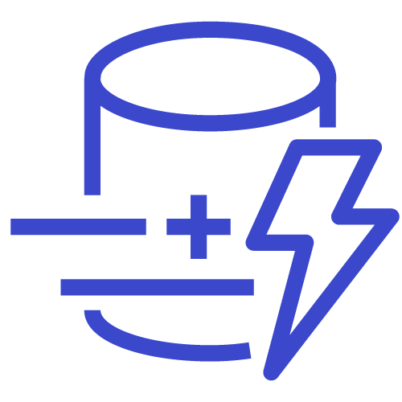

# aws

Namespace | Name | Icon
--|--|--
diagram.aws.database.quantum-ledger-database-qldb|QuantumLedgerDatabaseQldb|
diagram.aws.database.redshift|Redshift|
diagram.aws.database.dynamodb|Dynamodb|
diagram.aws.database.dynamodb-table|DynamodbTable|
diagram.aws.database.database|Database|
diagram.aws.database.database-migration-service|DatabaseMigrationService|
diagram.aws.database.aurora|Aurora|
diagram.aws.database.timestream|Timestream|
diagram.aws.database.dynamodb-global-secondary-index|DynamodbGlobalSecondaryIndex|
diagram.aws.database.dynamodb-dax|DynamodbDax|
diagram.aws.database.neptune|Neptune|
diagram.aws.database.rds|Rds|
diagram.aws.database.documentdb-mongodb-compatibility|DocumentdbMongodbCompatibility|
diagram.aws.database.rds-on-vmware|RdsOnVmware|
diagram.aws.database.elasticache|Elasticache|
diagram.aws.security.security-hub|SecurityHub|
diagram.aws.security.waf|Waf|
diagram.aws.security.shield|Shield|
diagram.aws.security.cloud-directory|CloudDirectory|
diagram.aws.security.identity-and-access-management-iam-role|IdentityAndAccessManagementIamRole|
diagram.aws.security.identity-and-access-management-iam-permissions|IdentityAndAccessManagementIamPermissions|
diagram.aws.security.detective|Detective|
diagram.aws.security.inspector|Inspector|
diagram.aws.security.single-sign-on|SingleSignOn|
diagram.aws.security.secrets-manager|SecretsManager|
diagram.aws.security.artifact|Artifact|
diagram.aws.security.identity-and-access-management-iam|IdentityAndAccessManagementIam|
diagram.aws.security.cognito|Cognito|
diagram.aws.security.directory-service|DirectoryService|
diagram.aws.security.key-management-service|KeyManagementService|
diagram.aws.security.identity-and-access-management-iam-aws-sts|IdentityAndAccessManagementIamAwsSts|
diagram.aws.security.resource-access-manager|ResourceAccessManager|
diagram.aws.security.firewall-manager|FirewallManager|
diagram.aws.security.guardduty|Guardduty|
diagram.aws.security.certificate-manager|CertificateManager|
diagram.aws.security.identity-and-access-management-iam-access-analyzer|IdentityAndAccessManagementIamAccessAnalyzer|
diagram.aws.security.security-identity-and-compliance|SecurityIdentityAndCompliance|
diagram.aws.security.macie|Macie|
diagram.aws.security.cloudhsm|Cloudhsm|
diagram.aws.general.generic-office-building|GenericOfficeBuilding|
diagram.aws.general.traditional-server|TraditionalServer|
diagram.aws.general.generic-firewall|GenericFirewall|
diagram.aws.general.generic-database|GenericDatabase|
diagram.aws.general.user|User|
diagram.aws.general.users|Users|
diagram.aws.general.generic-saml-token|GenericSamlToken|
diagram.aws.general.marketplace|Marketplace|
diagram.aws.general.general|General|
diagram.aws.general.disk|Disk|
diagram.aws.general.generic-sdk|GenericSdk|
diagram.aws.integration.application-integration|ApplicationIntegration|
diagram.aws.integration.mq|Mq|
diagram.aws.integration.step-functions|StepFunctions|
diagram.aws.integration.appsync|Appsync|
diagram.aws.integration.eventbridge|Eventbridge|
diagram.aws.integration.console-mobile-application|ConsoleMobileApplication|
diagram.aws.integration.simple-notification-service-sns|SimpleNotificationServiceSns|
diagram.aws.integration.simple-queue-service-sqs|SimpleQueueServiceSqs|
diagram.aws.enduser.workspaces|Workspaces|
diagram.aws.enduser.worklink|Worklink|
diagram.aws.enduser.appstream-2-0|Appstream20|
diagram.aws.enduser.workdocs|Workdocs|
diagram.aws.robotics.robomaker-simulator|RobomakerSimulator|
diagram.aws.robotics.robomaker|Robomaker|
diagram.aws.robotics.robotics|Robotics|
diagram.aws.network.networking-and-content-delivery|NetworkingAndContentDelivery|
diagram.aws.network.vpc-peering|VpcPeering|
diagram.aws.network.nat-gateway|NatGateway|
diagram.aws.network.site-to-site-vpn|SiteToSiteVpn|
diagram.aws.network.route-53|Route53|
diagram.aws.network.internet-gateway|InternetGateway|
diagram.aws.network.cloudfront|Cloudfront|
diagram.aws.network.elastic-load-balancing|ElasticLoadBalancing|
diagram.aws.network.vpc-router|VpcRouter|
diagram.aws.network.app-mesh|AppMesh|
diagram.aws.network.transit-gateway|TransitGateway|
diagram.aws.network.global-accelerator|GlobalAccelerator|
diagram.aws.network.privatelink|Privatelink|
diagram.aws.network.direct-connect|DirectConnect|
diagram.aws.network.private-subnet|PrivateSubnet|
diagram.aws.network.cloud-map|CloudMap|
diagram.aws.network.route-table|RouteTable|
diagram.aws.network.endpoint|Endpoint|
diagram.aws.network.api-gateway|ApiGateway|
diagram.aws.network.nacl|Nacl|
diagram.aws.network.public-subnet|PublicSubnet|
diagram.aws.network.client-vpn|ClientVpn|
diagram.aws.network.vpc|Vpc|
diagram.aws.cost.savings-plans|SavingsPlans|
diagram.aws.cost.cost-and-usage-report|CostAndUsageReport|
diagram.aws.cost.reserved-instance-reporting|ReservedInstanceReporting|
diagram.aws.cost.budgets|Budgets|
diagram.aws.cost.cost-explorer|CostExplorer|
diagram.aws.business.alexa-for-business|AlexaForBusiness|
diagram.aws.business.workmail|Workmail|
diagram.aws.business.chime|Chime|
diagram.aws.management.managed-services|ManagedServices|
diagram.aws.management.command-line-interface|CommandLineInterface|
diagram.aws.management.trusted-advisor|TrustedAdvisor|
diagram.aws.management.license-manager|LicenseManager|
diagram.aws.management.opsworks|Opsworks|
diagram.aws.management.config|Config|
diagram.aws.management.codeguru|Codeguru|
diagram.aws.management.auto-scaling|AutoScaling|
diagram.aws.management.systems-manager|SystemsManager|
diagram.aws.management.organizations|Organizations|
diagram.aws.management.control-tower|ControlTower|
diagram.aws.management.management-console|ManagementConsole|
diagram.aws.management.cloudtrail|Cloudtrail|
diagram.aws.management.cloudwatch|Cloudwatch|
diagram.aws.management.systems-manager-parameter-store|SystemsManagerParameterStore|
diagram.aws.management.service-catalog|ServiceCatalog|
diagram.aws.management.cloudformation|Cloudformation|
diagram.aws.management.well-architected-tool|WellArchitectedTool|
diagram.aws.game.gamelift|Gamelift|
diagram.aws.storage.fsx-for-windows-file-server|FsxForWindowsFileServer|
diagram.aws.storage.cloudendure-disaster-recovery|CloudendureDisasterRecovery|
diagram.aws.storage.efs-infrequentaccess-primary-bg|EfsInfrequentaccessPrimaryBg|
diagram.aws.storage.simple-storage-service-s3|SimpleStorageServiceS3|
diagram.aws.storage.snowball|Snowball|
diagram.aws.storage.efs-standard-primary-bg|EfsStandardPrimaryBg|
diagram.aws.storage.fsx|Fsx|
diagram.aws.storage.storage-gateway|StorageGateway|
diagram.aws.storage.backup|Backup|
diagram.aws.storage.snowball-edge|SnowballEdge|
diagram.aws.storage.snowmobile|Snowmobile|
diagram.aws.storage.elastic-block-store-ebs|ElasticBlockStoreEbs|
diagram.aws.storage.fsx-for-lustre|FsxForLustre|
diagram.aws.storage.s3-glacier|S3Glacier|
diagram.aws.storage.storage|Storage|
diagram.aws.storage.elastic-file-system-efs|ElasticFileSystemEfs|
diagram.aws.iot.iot-rule|IotRule|
diagram.aws.iot.iot-events|IotEvents|
diagram.aws.iot.internet-of-things|InternetOfThings|
diagram.aws.iot.freertos|Freertos|
diagram.aws.iot.iot-http2|IotHttp2|
diagram.aws.iot.iot-alexa-echo|IotAlexaEcho|
diagram.aws.iot.iot-policy|IotPolicy|
diagram.aws.iot.iot-action|IotAction|
diagram.aws.iot.iot-http|IotHttp|
diagram.aws.iot.iot-policy-emergency|IotPolicyEmergency|
diagram.aws.iot.iot-greengrass-connector|IotGreengrassConnector|
diagram.aws.iot.iot-things-graph|IotThingsGraph|
diagram.aws.iot.iot-jobs|IotJobs|
diagram.aws.iot.iot-button|IotButton|
diagram.aws.iot.iot-topic|IotTopic|
diagram.aws.iot.iot-camera|IotCamera|
diagram.aws.iot.iot-1-click|Iot1Click|
diagram.aws.iot.iot-hardware-board|IotHardwareBoard|
diagram.aws.iot.iot-shadow|IotShadow|
diagram.aws.iot.iot-device-management|IotDeviceManagement|
diagram.aws.iot.iot-alexa-skill|IotAlexaSkill|
diagram.aws.iot.iot-device-defender|IotDeviceDefender|
diagram.aws.iot.iot-sitewise|IotSitewise|
diagram.aws.iot.iot-core|IotCore|
diagram.aws.iot.iot-lambda|IotLambda|
diagram.aws.iot.iot-greengrass|IotGreengrass|
diagram.aws.iot.iot-mqtt|IotMqtt|
diagram.aws.iot.iot-certificate|IotCertificate|
diagram.aws.iot.iot-analytics|IotAnalytics|
diagram.aws.engagement.pinpoint|Pinpoint|
diagram.aws.engagement.connect|Connect|
diagram.aws.engagement.simple-email-service-ses|SimpleEmailServiceSes|
diagram.aws.blockchain.quantum-ledger-database-qldb|QuantumLedgerDatabaseQldb|
diagram.aws.blockchain.managed-blockchain|ManagedBlockchain|
diagram.aws.compute.batch|Batch|
diagram.aws.compute.elastic-kubernetes-service|ElasticKubernetesService|
diagram.aws.compute.compute|Compute|
diagram.aws.compute.elastic-beanstalk-rounded|ElasticBeanstalkRounded|
diagram.aws.compute.thinkbox-frost|ThinkboxFrost|
diagram.aws.compute.ec2-container-registry-rounded|Ec2ContainerRegistryRounded|
diagram.aws.compute.thinkbox-deadline-rounded|ThinkboxDeadlineRounded|
diagram.aws.compute.thinkbox-stoke-rounded|ThinkboxStokeRounded|
diagram.aws.compute.compute-rounded|ComputeRounded|
diagram.aws.compute.thinkbox-stoke|ThinkboxStoke|
diagram.aws.compute.ec2-rounded|Ec2Rounded|
diagram.aws.compute.thinkbox-draft-rounded|ThinkboxDraftRounded|
diagram.aws.compute.ec2-container-registry|Ec2ContainerRegistry|
diagram.aws.compute.ec2|Ec2|
diagram.aws.compute.batch-rounded|BatchRounded|
diagram.aws.compute.thinkbox-deadline|ThinkboxDeadline|
diagram.aws.compute.fargate|Fargate|
diagram.aws.compute.thinkbox-krakatoa-rounded|ThinkboxKrakatoaRounded|
diagram.aws.compute.outposts|Outposts|
diagram.aws.compute.application-auto-scaling-rounded|ApplicationAutoScalingRounded|
diagram.aws.compute.elastic-container-service-rounded|ElasticContainerServiceRounded|
diagram.aws.compute.elastic-kubernetes-service-rounded|ElasticKubernetesServiceRounded|
diagram.aws.compute.lambda-rounded|LambdaRounded|
diagram.aws.compute.thinkbox-draft|ThinkboxDraft|
diagram.aws.compute.thinkbox-frost-rounded|ThinkboxFrostRounded|
diagram.aws.compute.fargate-rounded|FargateRounded|
diagram.aws.compute.vmware-cloud-on-aws|VmwareCloudOnAws|
diagram.aws.compute.thinkbox-xmesh-rounded|ThinkboxXmeshRounded|
diagram.aws.compute.thinkbox-xmesh|ThinkboxXmesh|
diagram.aws.compute.lambda|Lambda|
diagram.aws.compute.vmware-cloud-on-aws-rounded|VmwareCloudOnAwsRounded|
diagram.aws.compute.outposts-rounded|OutpostsRounded|
diagram.aws.compute.thinkbox-krakatoa|ThinkboxKrakatoa|
diagram.aws.compute.thinkbox-sequoia-rounded|ThinkboxSequoiaRounded|
diagram.aws.compute.elastic-container-service|ElasticContainerService|
diagram.aws.compute.lightsail-rounded|LightsailRounded|
diagram.aws.compute.application-auto-scaling|ApplicationAutoScaling|
diagram.aws.compute.serverless-application-repository-rounded|ServerlessApplicationRepositoryRounded|
diagram.aws.compute.serverless-application-repository|ServerlessApplicationRepository|
diagram.aws.compute.elastic-beanstalk|ElasticBeanstalk|
diagram.aws.compute.thinkbox-sequoia|ThinkboxSequoia|
diagram.aws.compute.lightsail|Lightsail|
diagram.aws.devtools.x-ray|XRay|
diagram.aws.devtools.command-line-interface|CommandLineInterface|
diagram.aws.devtools.tools-and-sdks|ToolsAndSdks|
diagram.aws.devtools.codepipeline|Codepipeline|
diagram.aws.devtools.codebuild|Codebuild|
diagram.aws.devtools.cloud9|Cloud9|
diagram.aws.devtools.cloud-development-kit|CloudDevelopmentKit|
diagram.aws.devtools.codestar|Codestar|
diagram.aws.devtools.developer-tools|DeveloperTools|
diagram.aws.devtools.codecommit|Codecommit|
diagram.aws.devtools.codedeploy|Codedeploy|
diagram.aws.ml.deepracer|Deepracer|
diagram.aws.ml.sagemaker|Sagemaker|
diagram.aws.ml.sagemaker-ground-truth|SagemakerGroundTruth|
diagram.aws.ml.polly|Polly|
diagram.aws.ml.transcribe|Transcribe|
diagram.aws.ml.machine-learning|MachineLearning|
diagram.aws.ml.rekognition|Rekognition|
diagram.aws.ml.lex|Lex|
diagram.aws.ml.sagemaker-model|SagemakerModel|
diagram.aws.ml.sagemaker-notebook|SagemakerNotebook|
diagram.aws.ml.deeplens|Deeplens|
diagram.aws.ml.tensorflow-on-aws|TensorflowOnAws|
diagram.aws.ml.deep-learning-containers|DeepLearningContainers|
diagram.aws.ml.translate|Translate|
diagram.aws.ml.textract|Textract|
diagram.aws.ml.deep-learning-amis|DeepLearningAmis|
diagram.aws.ml.comprehend|Comprehend|
diagram.aws.ml.personalize|Personalize|
diagram.aws.ml.apache-mxnet-on-aws|ApacheMxnetOnAws|
diagram.aws.ml.sagemaker-training-job|SagemakerTrainingJob|
diagram.aws.ml.forecast|Forecast|
diagram.aws.ml.elastic-inference|ElasticInference|
diagram.aws.mobile.pinpoint|Pinpoint|
diagram.aws.mobile.appsync|Appsync|
diagram.aws.mobile.api-gateway-endpoint|ApiGatewayEndpoint|
diagram.aws.mobile.amplify|Amplify|
diagram.aws.mobile.api-gateway|ApiGateway|
diagram.aws.mobile.device-farm|DeviceFarm|
diagram.aws.ar.sumerian|Sumerian|
diagram.aws.satellite.ground-station|GroundStation|
diagram.aws.migration.server-migration-service|ServerMigrationService|
diagram.aws.migration.application-discovery-service|ApplicationDiscoveryService|
diagram.aws.migration.transfer-for-sftp|TransferForSftp|
diagram.aws.migration.migration-and-transfer|MigrationAndTransfer|
diagram.aws.migration.datasync|Datasync|
diagram.aws.migration.database-migration-service|DatabaseMigrationService|
diagram.aws.migration.snowball|Snowball|
diagram.aws.migration.cloudendure-migration|CloudendureMigration|
diagram.aws.migration.migration-hub|MigrationHub|
diagram.aws.migration.snowball-edge|SnowballEdge|
diagram.aws.migration.snowmobile|Snowmobile|
diagram.aws.enablement.managed-services|ManagedServices|
diagram.aws.enablement.support|Support|
diagram.aws.enablement.iq|Iq|
diagram.aws.enablement.professional-services|ProfessionalServices|
diagram.aws.analytics.kinesis-video-streams|KinesisVideoStreams|
diagram.aws.analytics.redshift-dense-compute-node|RedshiftDenseComputeNode|
diagram.aws.analytics.redshift|Redshift|
diagram.aws.analytics.athena|Athena|
diagram.aws.analytics.data-pipeline|DataPipeline|
diagram.aws.analytics.glue-crawlers|GlueCrawlers|
diagram.aws.analytics.emr-hdfs-cluster|EmrHdfsCluster|
diagram.aws.analytics.elasticsearch-service|ElasticsearchService|
diagram.aws.analytics.kinesis-data-streams|KinesisDataStreams|
diagram.aws.analytics.kinesis-data-firehose|KinesisDataFirehose|
diagram.aws.analytics.emr-cluster|EmrCluster|
diagram.aws.analytics.emr|Emr|
diagram.aws.analytics.quicksight|Quicksight|
diagram.aws.analytics.cloudsearch-search-documents|CloudsearchSearchDocuments|
diagram.aws.analytics.glue|Glue|
diagram.aws.analytics.kinesis-data-analytics|KinesisDataAnalytics|
diagram.aws.analytics.redshift-dense-storage-node|RedshiftDenseStorageNode|
diagram.aws.analytics.managed-streaming-for-kafka|ManagedStreamingForKafka|
diagram.aws.analytics.glue-data-catalog|GlueDataCatalog|
diagram.aws.analytics.analytics|Analytics|
diagram.aws.analytics.kinesis|Kinesis|
diagram.aws.analytics.lake-formation|LakeFormation|
diagram.aws.analytics.cloudsearch|Cloudsearch|
diagram.aws.quantum.braket|Braket|
diagram.aws.media.elemental-live|ElementalLive|
diagram.aws.media.elemental-mediaconvert|ElementalMediaconvert|
diagram.aws.media.elemental-mediastore|ElementalMediastore|
diagram.aws.media.elemental-mediatailor|ElementalMediatailor|
diagram.aws.media.elemental-delta|ElementalDelta|
diagram.aws.media.elemental-conductor|ElementalConductor|
diagram.aws.media.elemental-server|ElementalServer|
diagram.aws.media.elemental-medialive|ElementalMedialive|
diagram.aws.media.elemental-mediapackage|ElementalMediapackage|
diagram.aws.media.elastic-transcoder|ElasticTranscoder|
diagram.aws.media.elemental-mediaconnect|ElementalMediaconnect|
