# azure

Namespace | Name | Icon
--|--|--
`diagram.azure.database`|ElasticDatabasePools|
`diagram.azure.database`|BlobStorage|
`diagram.azure.database`|SqlServers|
`diagram.azure.database`|SqlManagedInstances|
`diagram.azure.database`|DataLake|
`diagram.azure.database`|CacheForRedis|
`diagram.azure.database`|ManagedDatabases|
`diagram.azure.database`|SqlDatawarehouse|
`diagram.azure.database`|ElasticJobAgents|
`diagram.azure.database`|SqlDatabases|
`diagram.azure.database`|DatabaseForPostgresqlServers|
`diagram.azure.database`|VirtualDatacenter|
`diagram.azure.database`|CosmosDb|
`diagram.azure.database`|VirtualClusters|
`diagram.azure.database`|SqlServerStretchDatabases|
`diagram.azure.database`|DatabaseForMysqlServers|
`diagram.azure.database`|DatabaseForMariadbServers|
`diagram.azure.devops`|DevtestLabs|
`diagram.azure.devops`|Repos|
`diagram.azure.devops`|Boards|
`diagram.azure.devops`|ApplicationInsights|
`diagram.azure.devops`|TestPlans|
`diagram.azure.devops`|Devops|
`diagram.azure.devops`|Artifacts|
`diagram.azure.devops`|Pipelines|
`diagram.azure.identity`|ConditionalAccess|
`diagram.azure.identity`|ActiveDirectoryConnectHealth|
`diagram.azure.identity`|ManagedIdentities|
`diagram.azure.identity`|AppRegistrations|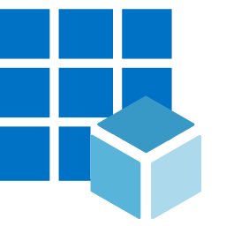
`diagram.azure.identity`|ActiveDirectory|
`diagram.azure.identity`|AdB2c|
`diagram.azure.identity`|AdIdentityProtection|
`diagram.azure.identity`|AdPrivilegedIdentityManagement|
`diagram.azure.identity`|IdentityGovernance|
`diagram.azure.identity`|AccessReview|
`diagram.azure.identity`|InformationProtection|
`diagram.azure.identity`|EnterpriseApplications|
`diagram.azure.identity`|AdDomainServices|
`diagram.azure.security`|SecurityCenter|
`diagram.azure.security`|Sentinel|
`diagram.azure.security`|KeyVaults|
`diagram.azure.general`|Resourcegroups|
`diagram.azure.general`|Developertools|
`diagram.azure.general`|Subscriptions|
`diagram.azure.general`|Support|
`diagram.azure.general`|Twousericon|
`diagram.azure.general`|Templates|
`diagram.azure.general`|Azurehome|
`diagram.azure.general`|Userprivacy|
`diagram.azure.general`|Userhealthicon|
`diagram.azure.general`|Recent|
`diagram.azure.general`|Whatsnew|
`diagram.azure.general`|Tag|
`diagram.azure.general`|Supportrequests|
`diagram.azure.general`|Userresource|
`diagram.azure.general`|Information|
`diagram.azure.general`|Allresources|
`diagram.azure.general`|Servicehealth|
`diagram.azure.general`|Quickstartcenter|
`diagram.azure.general`|Usericon|
`diagram.azure.general`|Tags|
`diagram.azure.general`|Marketplace|
`diagram.azure.general`|Managementgroups|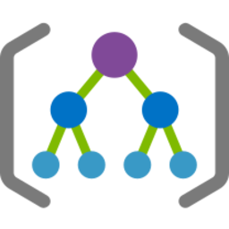
`diagram.azure.general`|Shareddashboard|
`diagram.azure.general`|Reservations|
`diagram.azure.general`|Resource|
`diagram.azure.general`|Helpsupport|
`diagram.azure.web`|Signalr|
`diagram.azure.web`|MediaServices|
`diagram.azure.web`|AppServiceCertificates|
`diagram.azure.web`|AppServiceEnvironments|
`diagram.azure.web`|AppServiceDomains|
`diagram.azure.web`|ApiConnections|
`diagram.azure.web`|Search|
`diagram.azure.web`|AppServices|
`diagram.azure.web`|NotificationHubNamespaces|
`diagram.azure.web`|AppServicePlans|
`diagram.azure.integration`|EventGridTopics|
`diagram.azure.integration`|LogicAppsCustomConnector|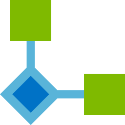
`diagram.azure.integration`|IntegrationServiceEnvironments|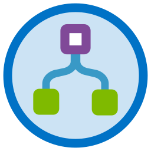
`diagram.azure.integration`|AppConfiguration|
`diagram.azure.integration`|EventGridDomains|
`diagram.azure.integration`|ApiForFhir|
`diagram.azure.integration`|DataCatalog|
`diagram.azure.integration`|ServiceCatalogManagedApplicationDefinitions|
`diagram.azure.integration`|LogicApps|
`diagram.azure.integration`|IntegrationAccounts|
`diagram.azure.integration`|SoftwareAsAService|
`diagram.azure.integration`|SendgridAccounts|
`diagram.azure.integration`|ApiManagement|
`diagram.azure.integration`|ServiceBusRelays|
`diagram.azure.integration`|EventGridSubscriptions|
`diagram.azure.integration`|ServiceBus|
`diagram.azure.integration`|StorsimpleDeviceManagers|
`diagram.azure.network`|RouteFilters|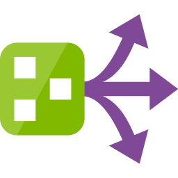
`diagram.azure.network`|DnsZones|
`diagram.azure.network`|ApplicationSecurityGroups|
`diagram.azure.network`|ExpressrouteCircuits|
`diagram.azure.network`|TrafficManagerProfiles|
`diagram.azure.network`|NetworkWatcher|
`diagram.azure.network`|PublicIpAddresses|
`diagram.azure.network`|Firewall|
`diagram.azure.network`|OnPremisesDataGateways|
`diagram.azure.network`|VirtualNetworks|
`diagram.azure.network`|RouteTables|
`diagram.azure.network`|DdosProtectionPlans|
`diagram.azure.network`|Connections|
`diagram.azure.network`|ApplicationGateway|
`diagram.azure.network`|DnsPrivateZones|
`diagram.azure.network`|Subnets|
`diagram.azure.network`|CdnProfiles|
`diagram.azure.network`|LoadBalancers|
`diagram.azure.network`|FrontDoors|
`diagram.azure.network`|NetworkInterfaces|
`diagram.azure.network`|VirtualNetworkClassic|
`diagram.azure.network`|ReservedIpAddressesClassic|
`diagram.azure.network`|VirtualWans|
`diagram.azure.network`|NetworkSecurityGroupsClassic|
`diagram.azure.network`|VirtualNetworkGateways|
`diagram.azure.network`|ServiceEndpointPolicies|
`diagram.azure.network`|LocalNetworkGateways|
`diagram.azure.storage`|BlobStorage|
`diagram.azure.storage`|StorageAccounts|
`diagram.azure.storage`|TableStorage|
`diagram.azure.storage`|StorageSyncServices|
`diagram.azure.storage`|DataBoxEdgeDataBoxGateway|
`diagram.azure.storage`|StorageAccountsClassic|
`diagram.azure.storage`|ArchiveStorage|
`diagram.azure.storage`|NetappFiles|
`diagram.azure.storage`|DataBox|
`diagram.azure.storage`|StorageExplorer|
`diagram.azure.storage`|DataLakeStorage|
`diagram.azure.storage`|StorsimpleDataManagers|
`diagram.azure.storage`|Azurefxtedgefiler|
`diagram.azure.storage`|QueuesStorage|
`diagram.azure.storage`|GeneralStorage|
`diagram.azure.storage`|StorsimpleDeviceManagers|
`diagram.azure.iot`|IotHub|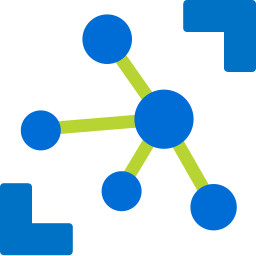
`diagram.azure.iot`|Sphere|
`diagram.azure.iot`|TimeSeriesInsightsEnvironments|
`diagram.azure.iot`|IotCentralApplications|
`diagram.azure.iot`|TimeSeriesInsightsEventsSources|
`diagram.azure.iot`|Windows10IotCoreServices|
`diagram.azure.iot`|DigitalTwins|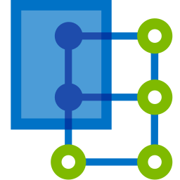
`diagram.azure.iot`|IotHubSecurity|
`diagram.azure.iot`|DeviceProvisioningServices|
`diagram.azure.iot`|Maps|
`diagram.azure.compute`|VmWindows|
`diagram.azure.compute`|Vm|
`diagram.azure.compute`|MeshApplications|
`diagram.azure.compute`|BatchAccounts|
`diagram.azure.compute`|CloudsimpleVirtualMachines|
`diagram.azure.compute`|DiskSnapshots|
`diagram.azure.compute`|CitrixVirtualDesktopsEssentials|
`diagram.azure.compute`|ServiceFabricClusters|
`diagram.azure.compute`|KubernetesServices|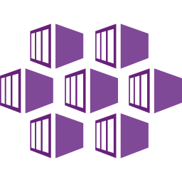
`diagram.azure.compute`|SapHanaOnAzure|
`diagram.azure.compute`|FunctionApps|
`diagram.azure.compute`|ContainerInstances|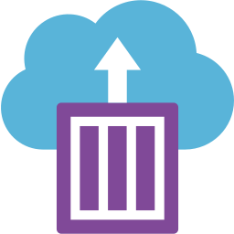
`diagram.azure.compute`|ContainerRegistries|
`diagram.azure.compute`|VmClassic|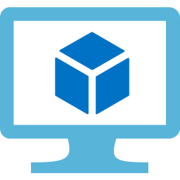
`diagram.azure.compute`|CloudServicesClassic|
`diagram.azure.compute`|Disks|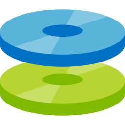
`diagram.azure.compute`|AvailabilitySets|
`diagram.azure.compute`|VmImages|
`diagram.azure.compute`|VmLinux|
`diagram.azure.compute`|CloudServices|
`diagram.azure.ml`|CognitiveServices|
`diagram.azure.ml`|MachineLearningStudioWebServicePlans|
`diagram.azure.ml`|MachineLearningStudioWebServices|
`diagram.azure.ml`|GenomicsAccounts|
`diagram.azure.ml`|MachineLearningStudioWorkspaces|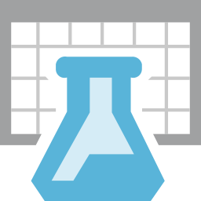
`diagram.azure.ml`|BotServices|
`diagram.azure.ml`|MachineLearningServiceWorkspaces|
`diagram.azure.ml`|BatchAi|
`diagram.azure.mobile`|AppServiceMobile|
`diagram.azure.mobile`|MobileEngagement|
`diagram.azure.mobile`|NotificationHubs|
`diagram.azure.migration`|MigrationProjects|
`diagram.azure.migration`|DatabaseMigrationServices|
`diagram.azure.migration`|RecoveryServicesVaults|
`diagram.azure.analytics`|DataExplorerClusters|
`diagram.azure.analytics`|StreamAnalyticsJobs|
`diagram.azure.analytics`|Databricks|
`diagram.azure.analytics`|DataLakeStoreGen1|
`diagram.azure.analytics`|Hdinsightclusters|
`diagram.azure.analytics`|AnalysisServices|
`diagram.azure.analytics`|DataLakeAnalytics|
`diagram.azure.analytics`|EventHubClusters|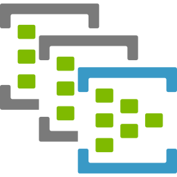
`diagram.azure.analytics`|LogAnalyticsWorkspaces|
`diagram.azure.analytics`|EventHubs|
`diagram.azure.analytics`|DataFactories|
