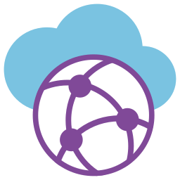
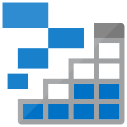
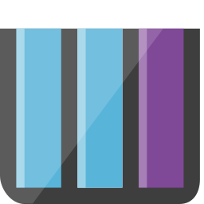

azure

Type | Name | Icon
--|--|--
database|elastic-database-pools.png|
database|blob-storage.png|
database|sql-servers.png|
database|sql-managed-instances.png|
database|data-lake.png|
database|cache-for-redis.png|
database|managed-databases.png|
database|sql-datawarehouse.png|
database|elastic-job-agents.png|
database|sql-databases.png|
database|database-for-postgresql-servers.png|
database|virtual-datacenter.png|
database|cosmos-db.png|
database|virtual-clusters.png|
database|sql-server-stretch-databases.png|
database|database-for-mysql-servers.png|
database|database-for-mariadb-servers.png|
devops|devtest-labs.png|
devops|repos.png|
devops|boards.png|
devops|application-insights.png|
devops|test-plans.png|
devops|devops.png|
devops|artifacts.png|
devops|pipelines.png|
identity|conditional-access.png|
identity|active-directory-connect-health.png|
identity|managed-identities.png|
identity|app-registrations.png|
identity|active-directory.png|
identity|ad-b2c.png|
identity|ad-identity-protection.png|
identity|ad-privileged-identity-management.png|
identity|identity-governance.png|
identity|access-review.png|
identity|information-protection.png|
identity|enterprise-applications.png|
identity|ad-domain-services.png|
security|security-center.png|
security|sentinel.png|
security|key-vaults.png|
general|resourcegroups.png|
general|developertools.png|
general|subscriptions.png|
general|support.png|
general|twousericon.png|
general|templates.png|
general|azurehome.png|
general|userprivacy.png|
general|userhealthicon.png|
general|recent.png|
general|whatsnew.png|
general|tag.png|
general|supportrequests.png|
general|userresource.png|
general|information.png|
general|allresources.png|
general|servicehealth.png|
general|quickstartcenter.png|
general|usericon.png|
general|tags.png|
general|marketplace.png|
general|managementgroups.png|
general|shareddashboard.png|
general|reservations.png|
general|resource.png|
general|helpsupport.png|
web|signalr.png|
web|media-services.png|
web|app-service-certificates.png|
web|app-service-environments.png|
web|app-service-domains.png|
web|api-connections.png|
web|search.png|
web|app-services.png|
web|notification-hub-namespaces.png|
web|app-service-plans.png|
integration|event-grid-topics.png|
integration|logic-apps-custom-connector.png|
integration|integration-service-environments.png|
integration|app-configuration.png|
integration|event-grid-domains.png|
integration|api-for-fhir.png|
integration|data-catalog.png|
integration|service-catalog-managed-application-definitions.png|
integration|logic-apps.png|
integration|integration-accounts.png|
integration|software-as-a-service.png|
integration|sendgrid-accounts.png|
integration|api-management.png|
integration|service-bus-relays.png|
integration|event-grid-subscriptions.png|
integration|service-bus.png|
integration|storsimple-device-managers.png|
network|route-filters.png|
network|dns-zones.png|
network|application-security-groups.png|
network|expressroute-circuits.png|
network|traffic-manager-profiles.png|
network|network-watcher.png|
network|public-ip-addresses.png|
network|firewall.png|
network|on-premises-data-gateways.png|
network|virtual-networks.png|
network|route-tables.png|
network|ddos-protection-plans.png|
network|connections.png|
network|application-gateway.png|
network|dns-private-zones.png|
network|subnets.png|
network|cdn-profiles.png|
network|load-balancers.png|
network|front-doors.png|
network|network-interfaces.png|
network|virtual-network-classic.png|
network|reserved-ip-addresses-classic.png|
network|virtual-wans.png|
network|network-security-groups-classic.png|
network|virtual-network-gateways.png|
network|service-endpoint-policies.png|
network|local-network-gateways.png|
storage|blob-storage.png|
storage|storage-accounts.png|
storage|table-storage.png|
storage|storage-sync-services.png|
storage|data-box-edge---data-box-gateway.png|
storage|storage-accounts-classic.png|
storage|archive-storage.png|
storage|netapp-files.png|
storage|data-box.png|
storage|storage-explorer.png|
storage|data-lake-storage.png|
storage|storsimple-data-managers.png|
storage|azurefxtedgefiler.png|
storage|queues-storage.png|
storage|general-storage.png|
storage|storsimple-device-managers.png|
iot|iot-hub.png|
iot|sphere.png|
iot|time-series-insights-environments.png|
iot|iot-central-applications.png|
iot|time-series-insights-events-sources.png|
iot|windows-10-iot-core-services.png|
iot|digital-twins.png|
iot|iot-hub-security.png|
iot|device-provisioning-services.png|
iot|maps.png|
compute|vm-windows.png|
compute|vm.png|
compute|mesh-applications.png|
compute|batch-accounts.png|
compute|cloudsimple-virtual-machines.png|
compute|disk-snapshots.png|
compute|citrix-virtual-desktops-essentials.png|
compute|service-fabric-clusters.png|
compute|kubernetes-services.png|
compute|sap-hana-on-azure.png|
compute|function-apps.png|
compute|container-instances.png|
compute|container-registries.png|
compute|vm-classic.png|
compute|cloud-services-classic.png|
compute|disks.png|
compute|availability-sets.png|
compute|vm-images.png|
compute|vm-linux.png|
compute|cloud-services.png|
ml|cognitive-services.png|
ml|machine-learning-studio-web-service-plans.png|
ml|machine-learning-studio-web-services.png|
ml|genomics-accounts.png|
ml|machine-learning-studio-workspaces.png|
ml|bot-services.png|
ml|machine-learning-service-workspaces.png|
ml|batch-ai.png|
mobile|app-service---mobile.png|
mobile|mobile-engagement.png|
mobile|notification-hubs.png|
migration|migration-projects.png|
migration|database-migration-services.png|
migration|recovery-services-vaults.png|
analytics|data-explorer-clusters.png|
analytics|stream-analytics-jobs.png|
analytics|databricks.png|
analytics|data-lake-store-gen1.png|
analytics|hdinsightclusters.png|
analytics|analysis-services.png|
analytics|data-lake-analytics.png|
analytics|event-hub-clusters.png|
analytics|log-analytics-workspaces.png|
analytics|event-hubs.png|
analytics|data-factories.png|
