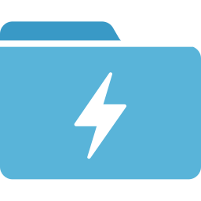

# azure

Namespace | Name | Icon
--|--|--
diagram.azure.database.elastic-database-pools|ElasticDatabasePools|
diagram.azure.database.blob-storage|BlobStorage|
diagram.azure.database.sql-servers|SqlServers|
diagram.azure.database.sql-managed-instances|SqlManagedInstances|
diagram.azure.database.data-lake|DataLake|
diagram.azure.database.cache-for-redis|CacheForRedis|
diagram.azure.database.managed-databases|ManagedDatabases|
diagram.azure.database.sql-datawarehouse|SqlDatawarehouse|
diagram.azure.database.elastic-job-agents|ElasticJobAgents|
diagram.azure.database.sql-databases|SqlDatabases|
diagram.azure.database.database-for-postgresql-servers|DatabaseForPostgresqlServers|
diagram.azure.database.virtual-datacenter|VirtualDatacenter|
diagram.azure.database.cosmos-db|CosmosDb|
diagram.azure.database.virtual-clusters|VirtualClusters|
diagram.azure.database.sql-server-stretch-databases|SqlServerStretchDatabases|
diagram.azure.database.database-for-mysql-servers|DatabaseForMysqlServers|
diagram.azure.database.database-for-mariadb-servers|DatabaseForMariadbServers|
diagram.azure.devops.devtest-labs|DevtestLabs|
diagram.azure.devops.repos|Repos|
diagram.azure.devops.boards|Boards|
diagram.azure.devops.application-insights|ApplicationInsights|
diagram.azure.devops.test-plans|TestPlans|
diagram.azure.devops.devops|Devops|
diagram.azure.devops.artifacts|Artifacts|
diagram.azure.devops.pipelines|Pipelines|
diagram.azure.identity.conditional-access|ConditionalAccess|
diagram.azure.identity.active-directory-connect-health|ActiveDirectoryConnectHealth|
diagram.azure.identity.managed-identities|ManagedIdentities|
diagram.azure.identity.app-registrations|AppRegistrations|
diagram.azure.identity.active-directory|ActiveDirectory|
diagram.azure.identity.ad-b2c|AdB2c|
diagram.azure.identity.ad-identity-protection|AdIdentityProtection|
diagram.azure.identity.ad-privileged-identity-management|AdPrivilegedIdentityManagement|
diagram.azure.identity.identity-governance|IdentityGovernance|
diagram.azure.identity.access-review|AccessReview|
diagram.azure.identity.information-protection|InformationProtection|
diagram.azure.identity.enterprise-applications|EnterpriseApplications|
diagram.azure.identity.ad-domain-services|AdDomainServices|
diagram.azure.security.security-center|SecurityCenter|
diagram.azure.security.sentinel|Sentinel|
diagram.azure.security.key-vaults|KeyVaults|
diagram.azure.general.resourcegroups|Resourcegroups|
diagram.azure.general.developertools|Developertools|
diagram.azure.general.subscriptions|Subscriptions|
diagram.azure.general.support|Support|
diagram.azure.general.twousericon|Twousericon|
diagram.azure.general.templates|Templates|
diagram.azure.general.azurehome|Azurehome|
diagram.azure.general.userprivacy|Userprivacy|
diagram.azure.general.userhealthicon|Userhealthicon|
diagram.azure.general.recent|Recent|
diagram.azure.general.whatsnew|Whatsnew|
diagram.azure.general.tag|Tag|
diagram.azure.general.supportrequests|Supportrequests|
diagram.azure.general.userresource|Userresource|
diagram.azure.general.information|Information|
diagram.azure.general.all|Allresources|
diagram.azure.general.servicehealth|Servicehealth|
diagram.azure.general.quickstartcenter|Quickstartcenter|
diagram.azure.general.usericon|Usericon|
diagram.azure.general.tags|Tags|
diagram.azure.general.marketplace|Marketplace|
diagram.azure.general.managementgroups|Managementgroups|
diagram.azure.general.shareddashboard|Shareddashboard|
diagram.azure.general.reservations|Reservations|
diagram.azure.general.resource|Resource|
diagram.azure.general.helpsupport|Helpsupport|
diagram.azure.web.signalr|Signalr|
diagram.azure.web.media-services|MediaServices|
diagram.azure.web.app-service-certificates|AppServiceCertificates|
diagram.azure.web.app-service-environments|AppServiceEnvironments|
diagram.azure.web.app-service-domains|AppServiceDomains|
diagram.azure.web.api-connections|ApiConnections|
diagram.azure.web.search|Search|
diagram.azure.web.app-services|AppServices|
diagram.azure.web.notification-hub-namespaces|NotificationHubNamespaces|
diagram.azure.web.app-service-plans|AppServicePlans|
diagram.azure.integration.event-grid-topics|EventGridTopics|
diagram.azure.integration.logic-apps-custom-connector|LogicAppsCustomConnector|
diagram.azure.integration.integration-service-environments|IntegrationServiceEnvironments|
diagram.azure.integration.app-configuration|AppConfiguration|
diagram.azure.integration.event-grid-domains|EventGridDomains|
diagram.azure.integration.api-for-fhir|ApiForFhir|
diagram.azure.integration.data-catalog|DataCatalog|
diagram.azure.integration.service-catalog-managed-application-definitions|ServiceCatalogManagedApplicationDefinitions|
diagram.azure.integration.logic-apps|LogicApps|
diagram.azure.integration.integration-accounts|IntegrationAccounts|
diagram.azure.integration.software-as-a-service|SoftwareAsAService|
diagram.azure.integration.sendgrid-accounts|SendgridAccounts|
diagram.azure.integration.api-management|ApiManagement|
diagram.azure.integration.service-bus-relays|ServiceBusRelays|
diagram.azure.integration.event-grid-subscriptions|EventGridSubscriptions|
diagram.azure.integration.service-bus|ServiceBus|
diagram.azure.integration.storsimple-device-managers|StorsimpleDeviceManagers|
diagram.azure.network.route-filters|RouteFilters|
diagram.azure.network.dns-zones|DnsZones|
diagram.azure.network.application-security-groups|ApplicationSecurityGroups|
diagram.azure.network.expressroute-circuits|ExpressrouteCircuits|
diagram.azure.network.traffic-manager-profiles|TrafficManagerProfiles|
diagram.azure.network.network-watcher|NetworkWatcher|
diagram.azure.network.public-ip-addresses|PublicIpAddresses|
diagram.azure.network.firewall|Firewall|
diagram.azure.network.on-premises-data-gateways|OnPremisesDataGateways|
diagram.azure.network.virtual-networks|VirtualNetworks|
diagram.azure.network.route-tables|RouteTables|
diagram.azure.network.ddos-protection-plans|DdosProtectionPlans|
diagram.azure.network.connections|Connections|
diagram.azure.network.application-gateway|ApplicationGateway|
diagram.azure.network.dns-private-zones|DnsPrivateZones|
diagram.azure.network.subnets|Subnets|
diagram.azure.network.cdn-profiles|CdnProfiles|
diagram.azure.network.load-balancers|LoadBalancers|
diagram.azure.network.front-doors|FrontDoors|
diagram.azure.network.network-interfaces|NetworkInterfaces|
diagram.azure.network.virtual-network-classic|VirtualNetworkClassic|
diagram.azure.network.reserved-ip-addresses-classic|ReservedIpAddressesClassic|
diagram.azure.network.virtual-wans|VirtualWans|
diagram.azure.network.network-security-groups-classic|NetworkSecurityGroupsClassic|
diagram.azure.network.virtual-network-gateways|VirtualNetworkGateways|
diagram.azure.network.service-endpoint-policies|ServiceEndpointPolicies|
diagram.azure.network.local-network-gateways|LocalNetworkGateways|
diagram.azure.storage.blob-storage|BlobStorage|
diagram.azure.storage.storage-accounts|StorageAccounts|
diagram.azure.storage.table-storage|TableStorage|
diagram.azure.storage.storage-sync-services|StorageSyncServices|
diagram.azure.storage.data-box-edge---data-box-gateway|DataBoxEdgeDataBoxGateway|
diagram.azure.storage.storage-accounts-classic|StorageAccountsClassic|
diagram.azure.storage.archive-storage|ArchiveStorage|
diagram.azure.storage.netapp-files|NetappFiles|
diagram.azure.storage.data-box|DataBox|
diagram.azure.storage.storage-explorer|StorageExplorer|
diagram.azure.storage.data-lake-storage|DataLakeStorage|
diagram.azure.storage.storsimple-data-managers|StorsimpleDataManagers|
diagram.azure.storage.azurefxtedgefiler|Azurefxtedgefiler|
diagram.azure.storage.queues-storage|QueuesStorage|
diagram.azure.storage.general-storage|GeneralStorage|
diagram.azure.storage.storsimple-device-managers|StorsimpleDeviceManagers|
diagram.azure.iot.iot-hub|IotHub|
diagram.azure.iot.sphere|Sphere|
diagram.azure.iot.time-series-insights-environments|TimeSeriesInsightsEnvironments|
diagram.azure.iot.iot-central-applications|IotCentralApplications|
diagram.azure.iot.time-series-insights-events-sources|TimeSeriesInsightsEventsSources|
diagram.azure.iot.windows-10-iot-core-services|Windows10IotCoreServices|
diagram.azure.iot.digital-twins|DigitalTwins|
diagram.azure.iot.iot-hub-security|IotHubSecurity|
diagram.azure.iot.device-provisioning-services|DeviceProvisioningServices|
diagram.azure.iot.maps|Maps|
diagram.azure.compute.vm-windows|VmWindows|
diagram.azure.compute.vm|Vm|
diagram.azure.compute.mesh-applications|MeshApplications|
diagram.azure.compute.batch-accounts|BatchAccounts|
diagram.azure.compute.cloudsimple-virtual-machines|CloudsimpleVirtualMachines|
diagram.azure.compute.disk-snapshots|DiskSnapshots|
diagram.azure.compute.citrix-virtual-desktops-essentials|CitrixVirtualDesktopsEssentials|
diagram.azure.compute.service-fabric-clusters|ServiceFabricClusters|
diagram.azure.compute.kubernetes-services|KubernetesServices|
diagram.azure.compute.sap-hana-on-azure|SapHanaOnAzure|
diagram.azure.compute.function-apps|FunctionApps|
diagram.azure.compute.container-instances|ContainerInstances|
diagram.azure.compute.container-registries|ContainerRegistries|
diagram.azure.compute.vm-classic|VmClassic|
diagram.azure.compute.cloud-services-classic|CloudServicesClassic|
diagram.azure.compute.disks|Disks|
diagram.azure.compute.availability-sets|AvailabilitySets|
diagram.azure.compute.vm-images|VmImages|
diagram.azure.compute.vm-linux|VmLinux|
diagram.azure.compute.cloud-services|CloudServices|
diagram.azure.ml.cognitive-services|CognitiveServices|
diagram.azure.ml.machine-learning-studio-web-service-plans|MachineLearningStudioWebServicePlans|
diagram.azure.ml.machine-learning-studio-web-services|MachineLearningStudioWebServices|
diagram.azure.ml.genomics-accounts|GenomicsAccounts|
diagram.azure.ml.machine-learning-studio-workspaces|MachineLearningStudioWorkspaces|
diagram.azure.ml.bot-services|BotServices|
diagram.azure.ml.machine-learning-service-workspaces|MachineLearningServiceWorkspaces|
diagram.azure.ml.batch-ai|BatchAi|
diagram.azure.mobile.app-service---mobile|AppServiceMobile|
diagram.azure.mobile.mobile-engagement|MobileEngagement|
diagram.azure.mobile.notification-hubs|NotificationHubs|
diagram.azure.migration.migration-projects|MigrationProjects|
diagram.azure.migration.database-migration-services|DatabaseMigrationServices|
diagram.azure.migration.recovery-services-vaults|RecoveryServicesVaults|
diagram.azure.analytics.data-explorer-clusters|DataExplorerClusters|
diagram.azure.analytics.stream-analytics-jobs|StreamAnalyticsJobs|
diagram.azure.analytics.databricks|Databricks|
diagram.azure.analytics.data-lake-store-gen1|DataLakeStoreGen1|
diagram.azure.analytics.hdinsightclusters|Hdinsightclusters|
diagram.azure.analytics.analysis-services|AnalysisServices|
diagram.azure.analytics.data-lake-analytics|DataLakeAnalytics|
diagram.azure.analytics.event-hub-clusters|EventHubClusters|
diagram.azure.analytics.log-analytics-workspaces|LogAnalyticsWorkspaces|
diagram.azure.analytics.event-hubs|EventHubs|
diagram.azure.analytics.data-factories|DataFactories|
