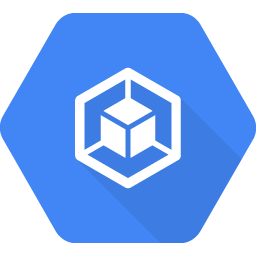
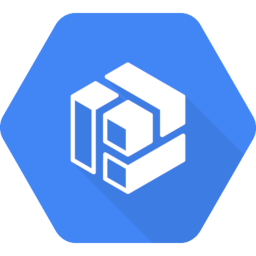

# gcp

Namespace | Name | Icon
--|--|--
diagram.gcp.database.memorystore|Memorystore|
diagram.gcp.database.firestore|Firestore|
diagram.gcp.database.datastore|Datastore|
diagram.gcp.database.sql|Sql|
diagram.gcp.database.bigtable|Bigtable|
diagram.gcp.database.spanner|Spanner|
diagram.gcp.security.security-command-center|SecurityCommandCenter|
diagram.gcp.security.iap|Iap|
diagram.gcp.security.iam|Iam|
diagram.gcp.security.security-scanner|SecurityScanner|
diagram.gcp.security.key-management-service|KeyManagementService|
diagram.gcp.security.resource-manager|ResourceManager|
diagram.gcp.network.vpn|Vpn|
diagram.gcp.network.dns|Dns|
diagram.gcp.network.nat|Nat|
diagram.gcp.network.external-ip-addresses|ExternalIpAddresses|
diagram.gcp.network.dedicated-interconnect|DedicatedInterconnect|
diagram.gcp.network.standard-network-tier|StandardNetworkTier|
diagram.gcp.network.armor|Armor|
diagram.gcp.network.virtual-private-cloud|VirtualPrivateCloud|
diagram.gcp.network.routes|Routes|
diagram.gcp.network.router|Router|
diagram.gcp.network.partner-interconnect|PartnerInterconnect|
diagram.gcp.network.cdn|Cdn|
diagram.gcp.network.firewall-rules|FirewallRules|
diagram.gcp.network.load-balancing|LoadBalancing|
diagram.gcp.network.premium-network-tier|PremiumNetworkTier|
diagram.gcp.network.network|Network|
diagram.gcp.network.traffic-director|TrafficDirector|
diagram.gcp.storage.persistent-disk|PersistentDisk|
diagram.gcp.storage.filestore|Filestore|
diagram.gcp.storage.storage|Storage|
diagram.gcp.iot.iot-core|IotCore|
diagram.gcp.compute.functions|Functions|
diagram.gcp.compute.kubernetes-engine|KubernetesEngine|
diagram.gcp.compute.gpu|Gpu|
diagram.gcp.compute.compute-engine|ComputeEngine|
diagram.gcp.compute.app-engine|AppEngine|
diagram.gcp.compute.run|Run|
diagram.gcp.compute.gke-on-prem|GkeOnPrem|
diagram.gcp.compute.container-optimized-os|ContainerOptimizedOs|
diagram.gcp.devtools.tools-for-powershell|ToolsForPowershell|
diagram.gcp.devtools.container-registry|ContainerRegistry|
diagram.gcp.devtools.code|Code|
diagram.gcp.devtools.maven-app-engine-plugin|MavenAppEnginePlugin|
diagram.gcp.devtools.tools-for-visual-studio|ToolsForVisualStudio|
diagram.gcp.devtools.build|Build|
diagram.gcp.devtools.source-repositories|SourceRepositories|
diagram.gcp.devtools.tasks|Tasks|
diagram.gcp.devtools.sdk|Sdk|
diagram.gcp.devtools.test-lab|TestLab|
diagram.gcp.devtools.code-for-intellij|CodeForIntellij|
diagram.gcp.devtools.tools-for-eclipse|ToolsForEclipse|
diagram.gcp.devtools.gradle-app-engine-plugin|GradleAppEnginePlugin|
diagram.gcp.devtools.scheduler|Scheduler|
diagram.gcp.devtools.ide-plugins|IdePlugins|
diagram.gcp.ml.dialog-flow-enterprise-edition|DialogFlowEnterpriseEdition|
diagram.gcp.ml.automl-tables|AutomlTables|
diagram.gcp.ml.translation-api|TranslationApi|
diagram.gcp.ml.vision-api|VisionApi|
diagram.gcp.ml.natural-language-api|NaturalLanguageApi|
diagram.gcp.ml.recommendations-ai|RecommendationsAi|
diagram.gcp.ml.ai-platform-data-labeling-service|AiPlatformDataLabelingService|
diagram.gcp.ml.automl-vision|AutomlVision|
diagram.gcp.ml.jobs-api|JobsApi|
diagram.gcp.ml.video-intelligence-api|VideoIntelligenceApi|
diagram.gcp.ml.automl|Automl|
diagram.gcp.ml.inference-api|InferenceApi|
diagram.gcp.ml.automl-translation|AutomlTranslation|
diagram.gcp.ml.automl-natural-language|AutomlNaturalLanguage|
diagram.gcp.ml.automl-video-intelligence|AutomlVideoIntelligence|
diagram.gcp.ml.advanced-solutions-lab|AdvancedSolutionsLab|
diagram.gcp.ml.text-to-speech|TextToSpeech|
diagram.gcp.ml.speech-to-text|SpeechToText|
diagram.gcp.ml.ai-hub|AiHub|
diagram.gcp.ml.tpu|Tpu|
diagram.gcp.ml.ai-platform|AiPlatform|
diagram.gcp.api.endpoints|Endpoints|
diagram.gcp.migration.transfer-appliance|TransferAppliance|
diagram.gcp.analytics.dataflow|Dataflow|
diagram.gcp.analytics.dataprep|Dataprep|
diagram.gcp.analytics.dataproc|Dataproc|
diagram.gcp.analytics.data-catalog|DataCatalog|
diagram.gcp.analytics.composer|Composer|
diagram.gcp.analytics.datalab|Datalab|
diagram.gcp.analytics.bigquery|Bigquery|
diagram.gcp.analytics.genomics|Genomics|
diagram.gcp.analytics.data-fusion|DataFusion|
diagram.gcp.analytics.pubsub|Pubsub|
