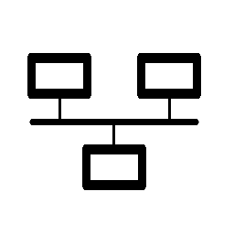

# generic

Namespace | Name | Icon
--|--|--
diagram.generic.database.sql|Sql|
diagram.generic.virtualization.vmware|Vmware|
diagram.generic.virtualization.virtualbox|Virtualbox|
diagram.generic.virtualization.xen|Xen|
diagram.generic.network.vpn|Vpn|
diagram.generic.network.firewall|Firewall|
diagram.generic.network.switch|Switch|
diagram.generic.network.router|Router|
diagram.generic.network.subnet|Subnet|
diagram.generic.storage.storage|Storage|
diagram.generic.blank.blank|Blank|
diagram.generic.compute.rack|Rack|
diagram.generic.device.tablet|Tablet|
diagram.generic.device.mobile|Mobile|
diagram.generic.os.android|Android|
diagram.generic.os.ios|Ios|
diagram.generic.os.windows|Windows|
diagram.generic.os.suse|Suse|
diagram.generic.os.ubuntu|Ubuntu|
diagram.generic.os.centos|Centos|
diagram.generic.os.linux-general|LinuxGeneral|
diagram.generic.place.datacenter|Datacenter|
