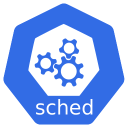

k8s

Type | Name | Icon
--|--|--
ecosystem|kustomize.png|
ecosystem|helm.png|
ecosystem|krew.png|
ecosystem|external-dns.png|
rbac|group.png|
rbac|sa.png|
rbac|rb.png|
rbac|user.png|
rbac|role.png|
rbac|c-role.png|
rbac|crb.png|
infra|etcd.png|
infra|master.png|
infra|node.png|
podconfig|cm.png|
podconfig|secret.png|
group|ns.png|
network|netpol.png|
network|ep.png|
network|ing.png|
network|svc.png|
others|psp.png|
others|crd.png|
storage|vol.png|
storage|sc.png|
storage|pvc.png|
storage|pv.png|
clusterconfig|hpa.png|
clusterconfig|limits.png|
clusterconfig|quota.png|
controlplane|sched.png|
controlplane|kubelet.png|
controlplane|c-m.png|
controlplane|c-c-m.png|
controlplane|api.png|
controlplane|k-proxy.png|
compute|sts.png|
compute|rs.png|
compute|deploy.png|
compute|cronjob.png|
compute|pod.png|
compute|ds.png|
compute|job.png|
chaos|litmus-chaos.png|
chaos|chaos-mesh.png|
