# oci

Namespace | Name | Icon
--|--|--
diagram.oci.database.dms-white.png|
diagram.oci.database.database-service-white.png|
diagram.oci.database.dataflow-apache-white.png|
diagram.oci.database.science.png|
diagram.oci.database.bigdata-service-white.png|
diagram.oci.database.dcat-white.png|
diagram.oci.database.dis.png|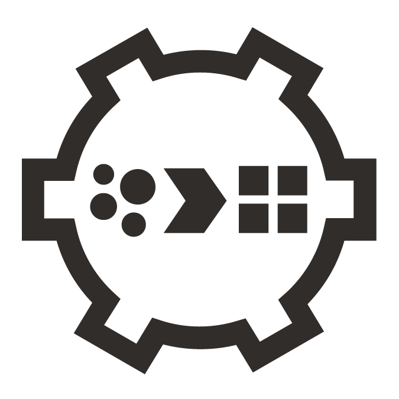
diagram.oci.database.stream-white.png|
diagram.oci.database.autonomous-white.png|
diagram.oci.database.autonomous.png|
diagram.oci.database.stream.png|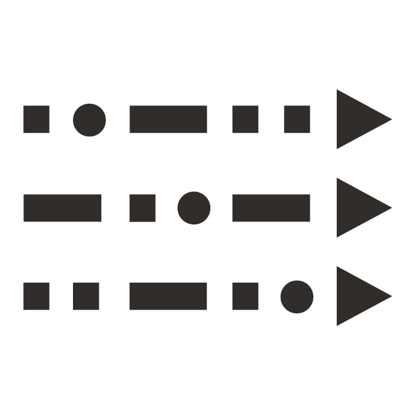
diagram.oci.database.dataflow-apache.png|
diagram.oci.database.science-white.png|
diagram.oci.database.dis-white.png|
diagram.oci.database.bigdata-service.png|
diagram.oci.database.database-service.png|
diagram.oci.database.dcat.png|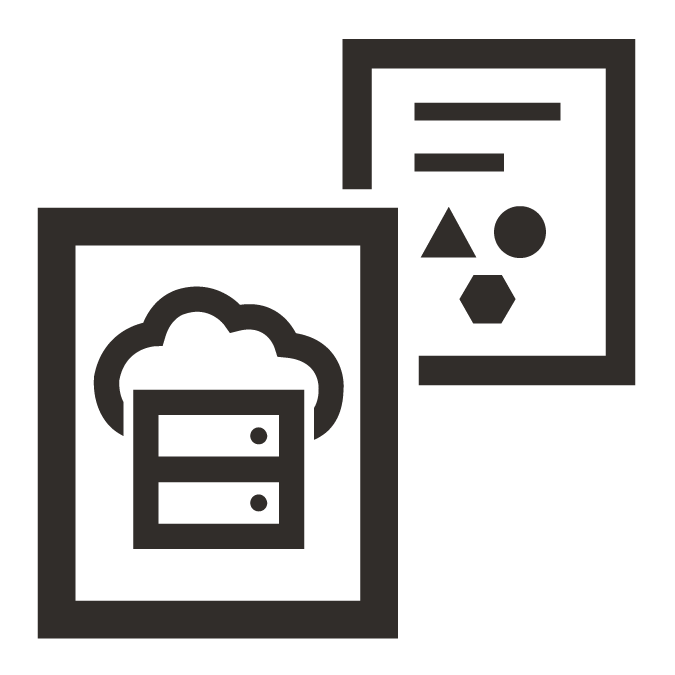
diagram.oci.database.dms.png|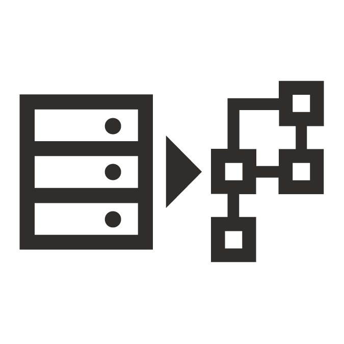
diagram.oci.devops.resource-mgmt.png|
diagram.oci.devops.api-service.png|
diagram.oci.devops.api-service-white.png|
diagram.oci.devops.api-gateway-white.png|
diagram.oci.devops.api-gateway.png|
diagram.oci.devops.resource-mgmt-white.png|
diagram.oci.connectivity.fast-connect.png|
diagram.oci.connectivity.vpn.png|
diagram.oci.connectivity.backbone.png|
diagram.oci.connectivity.disconnected-regions-white.png|
diagram.oci.connectivity.dns.png|
diagram.oci.connectivity.nat-gateway.png|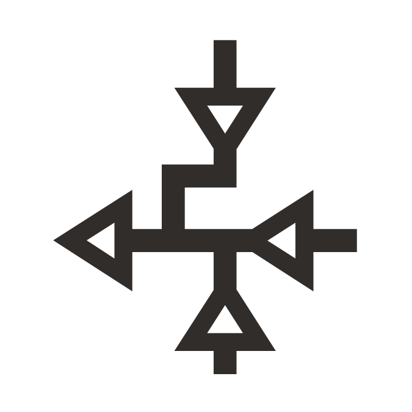
diagram.oci.connectivity.customer-premise-white.png|
diagram.oci.connectivity.disconnected-regions.png|
diagram.oci.connectivity.customer-datacenter.png|
diagram.oci.connectivity.cdn-white.png|
diagram.oci.connectivity.vpn-white.png|
diagram.oci.connectivity.customer-datacntr-white.png|
diagram.oci.connectivity.backbone-white.png|
diagram.oci.connectivity.customer-premise.png|
diagram.oci.connectivity.cdn.png|
diagram.oci.connectivity.dns-white.png|
diagram.oci.connectivity.fast-connect-white.png|
diagram.oci.connectivity.nat-gateway-white.png|
diagram.oci.security.waf.png|
diagram.oci.security.encryption.png|
diagram.oci.security.id-access-white.png|
diagram.oci.security.cloud-guard.png|
diagram.oci.security.ddos.png|
diagram.oci.security.max-security-zone-white.png|
diagram.oci.security.ddos-white.png|
diagram.oci.security.key-management.png|
diagram.oci.security.vault.png|
diagram.oci.security.vault-white.png|
diagram.oci.security.waf-white.png|
diagram.oci.security.key-management-white.png|
diagram.oci.security.id-access.png|
diagram.oci.security.max-security-zone.png|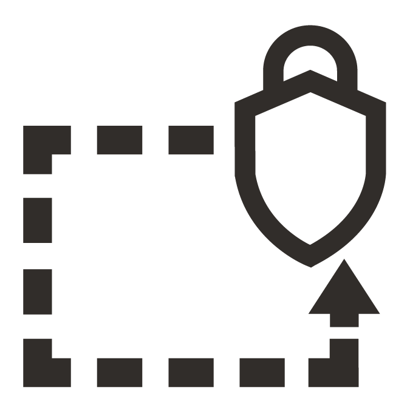
diagram.oci.security.cloud-guard-white.png|
diagram.oci.security.encryption-white.png|
diagram.oci.network.service-gateway.png|
diagram.oci.network.route-table-white.png|
diagram.oci.network.load-balancer-white.png|
diagram.oci.network.firewall-white.png|
diagram.oci.network.vcn.png|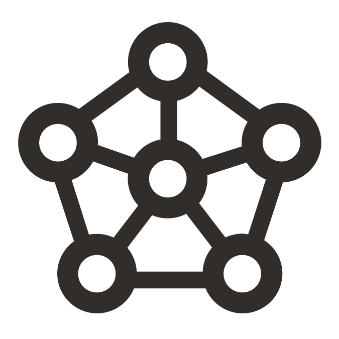
diagram.oci.network.firewall.png|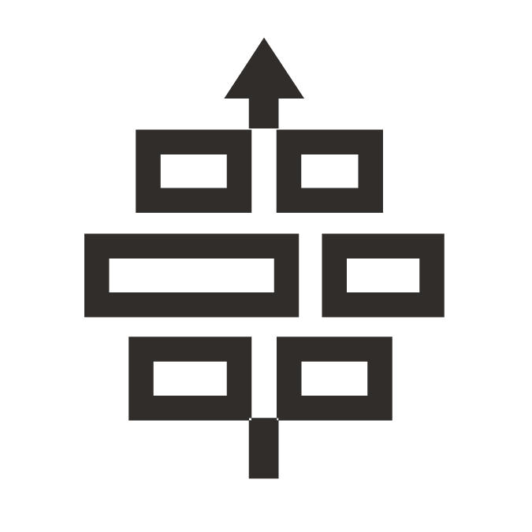
diagram.oci.network.internet-gateway.png|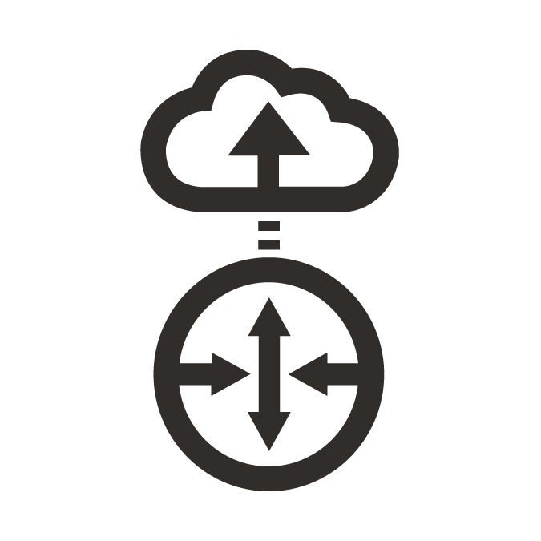
diagram.oci.network.load-balancer.png|
diagram.oci.network.service-gateway-white.png|
diagram.oci.network.security-lists.png|
diagram.oci.network.drg.png|
diagram.oci.network.security-lists-white.png|
diagram.oci.network.vcn-white.png|
diagram.oci.network.internet-gateway-white.png|
diagram.oci.network.route-table.png|
diagram.oci.network.drg-white.png|
diagram.oci.storage.block-storage-clone-white.png|
diagram.oci.storage.backup-restore.png|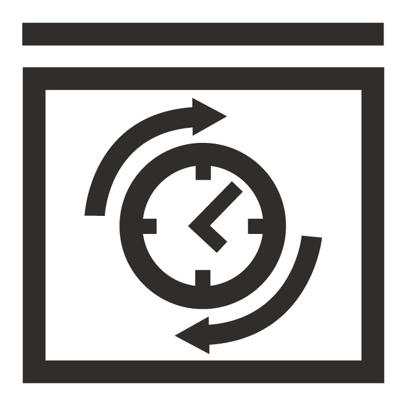
diagram.oci.storage.buckets.png|
diagram.oci.storage.storage-gateway-white.png|
diagram.oci.storage.block-storage-clone.png|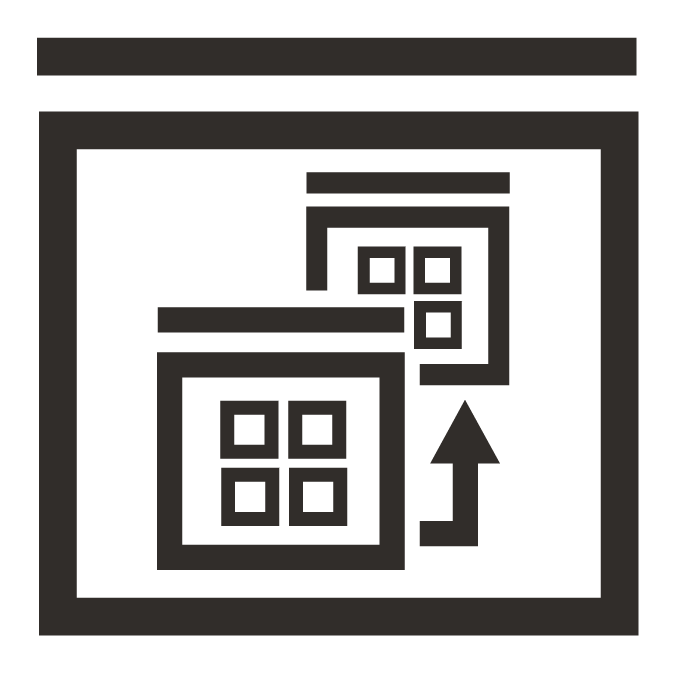
diagram.oci.storage.object-storage.png|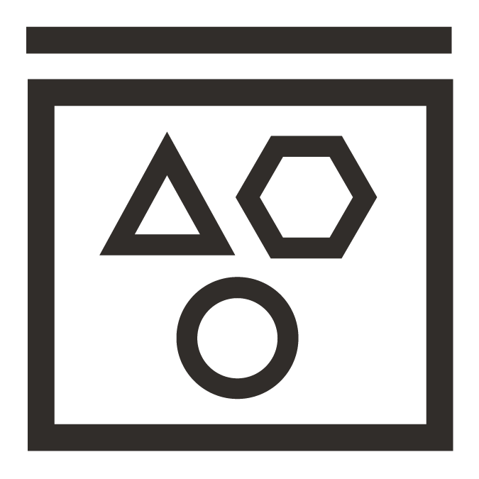
diagram.oci.storage.elastic-performance-white.png|
diagram.oci.storage.storage-gateway.png|
diagram.oci.storage.file-storage.png|
diagram.oci.storage.object-storage-white.png|
diagram.oci.storage.elastic-performance.png|
diagram.oci.storage.buckets-white.png|
diagram.oci.storage.block-storage-white.png|
diagram.oci.storage.backup-restore-white.png|
diagram.oci.storage.data-transfer-white.png|
diagram.oci.storage.file-storage-white.png|
diagram.oci.storage.data-transfer.png|
diagram.oci.storage.block-storage.png|
diagram.oci.compute.functions.png|
diagram.oci.compute.autoscale-white.png|
diagram.oci.compute.oke.png|
diagram.oci.compute.container.png|
diagram.oci.compute.bm-white.png|
diagram.oci.compute.vm.png|
diagram.oci.compute.bm.png|
diagram.oci.compute.functions-white.png|
diagram.oci.compute.instance-pools.png|
diagram.oci.compute.ocir-white.png|
diagram.oci.compute.instance-pools-white.png|
diagram.oci.compute.vm-white.png|
diagram.oci.compute.ocir.png|
diagram.oci.compute.oke-white.png|
diagram.oci.compute.container-white.png|
diagram.oci.compute.autoscale.png|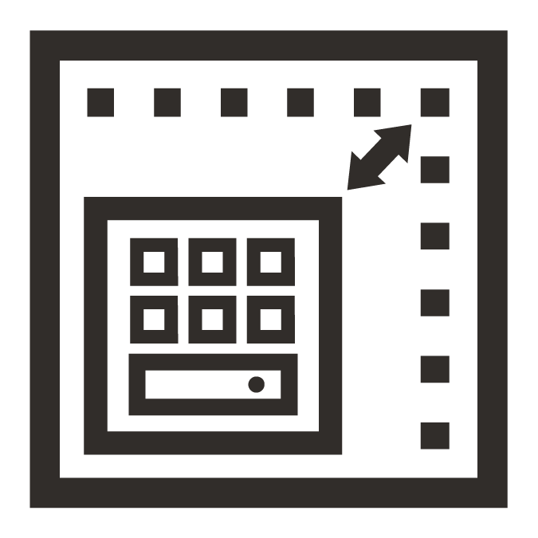
diagram.oci.governance.audit-white.png|
diagram.oci.governance.policies.png|
diagram.oci.governance.tagging.png|
diagram.oci.governance.tagging-white.png|
diagram.oci.governance.audit.png|
diagram.oci.governance.compartments-white.png|
diagram.oci.governance.groups-white.png|
diagram.oci.governance.compartments.png|
diagram.oci.governance.ocid-white.png|
diagram.oci.governance.policies-white.png|
diagram.oci.governance.ocid.png|
diagram.oci.governance.logging-white.png|
diagram.oci.governance.groups.png|
diagram.oci.governance.logging.png|
diagram.oci.monitoring.email.png|
diagram.oci.monitoring.telemetry.png|
diagram.oci.monitoring.email-white.png|
diagram.oci.monitoring.search-white.png|
diagram.oci.monitoring.health-check.png|
diagram.oci.monitoring.alarm-white.png|
diagram.oci.monitoring.telemetry-white.png|
diagram.oci.monitoring.workflow-white.png|
diagram.oci.monitoring.events.png|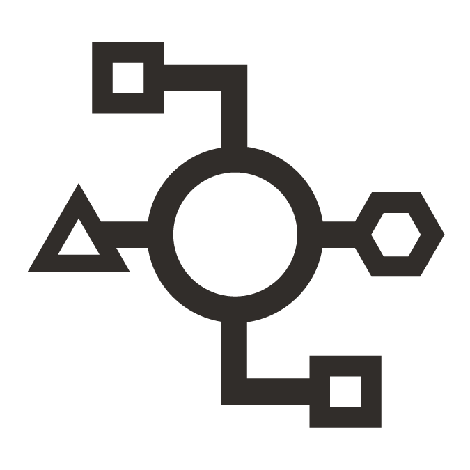
diagram.oci.monitoring.queue.png|
diagram.oci.monitoring.health-check-white.png|
diagram.oci.monitoring.search.png|
diagram.oci.monitoring.alarm.png|
diagram.oci.monitoring.queue-white.png|
diagram.oci.monitoring.notifications.png|
diagram.oci.monitoring.events-white.png|
diagram.oci.monitoring.workflow.png|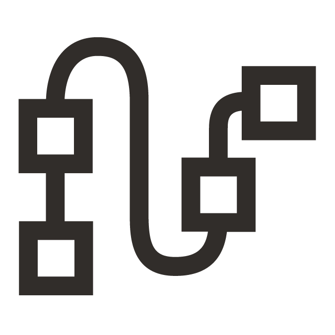
diagram.oci.monitoring.notifications-white.png|
