onprem

Type | Name | Icon
--|--|--
database|influxdb.png|
database|clickhouse.png|
database|janusgraph.png|
database|cockroachdb.png|
database|oracle.png|
database|hbase.png|
database|druid.png|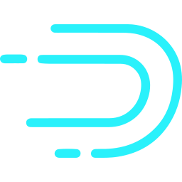
database|postgresql.png|
database|neo4j.png|
database|cassandra.png|
database|scylla.png|
database|mysql.png|
database|couchdb.png|
database|couchbase.png|
database|mssql.png|
database|dgraph.png|
database|mongodb.png|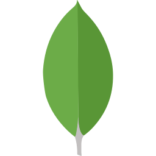
database|mariadb.png|
tracing|jaeger.png|
identity|dex.png|
security|vault.png|
security|trivy.png|
auth|oauth2-proxy.png|
auth|buzzfeed-sso.png|
proxmox|pve.png|
ci|gitlabci.png|
ci|teamcity.png|
ci|concourseci.png|
ci|zuulci.png|
ci|droneci.png|
ci|circleci.png|
ci|jenkins.png|
ci|github-actions.png|
ci|travisci.png|
etl|embulk.png|
mlops|polyaxon.png|
aggregator|fluentd.png|
aggregator|vector.png|
network|internet.png|
network|powerdns.png|
network|envoy.png|
network|pfsense.png|
network|kong.png|
network|etcd.png|
network|opnsense.png|
network|jbossas.png|
network|wildfly.png|
network|istio.png|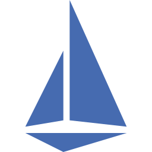
network|bind-9.png|
network|pomerium.png|
network|vyos.png|
network|haproxy.png|
network|apache.png|
network|open-service-mesh.png|
network|zookeeper.png|
network|nginx.png|
network|tomcat.png|
network|ocelot.png|
network|jetty.png|
network|gunicorn.png|
network|glassfish.png|
network|traefik.png|
network|linkerd.png|
network|caddy.png|
network|consul.png|
certificates|lets-encrypt.png|
certificates|cert-manager.png|
storage|ceph.png|
storage|glusterfs.png|
storage|ceph-osd.png|
inmemory|aerospike.png|
inmemory|hazelcast.png|
inmemory|redis.png|
inmemory|memcached.png|
search|solr.png|
container|rkt.png|
container|docker.png|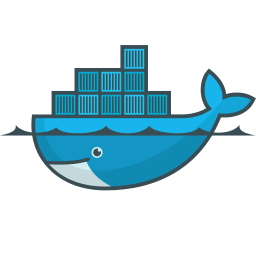
container|gvisor.png|
container|lxc.png|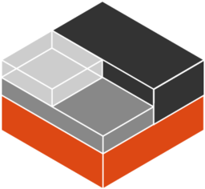
container|containerd.png|
container|crio.png|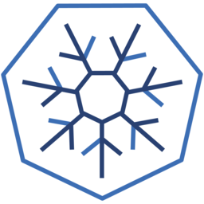
container|firecracker.png|
iac|atlantis.png|
iac|awx.png|
iac|ansible.png|
iac|terraform.png|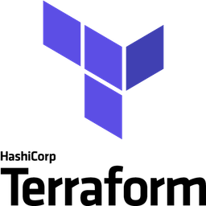
compute|server.png|
compute|nomad.png|
vcs|git.png|
vcs|github.png|
vcs|gitlab.png|
workflow|kubeflow.png|
workflow|airflow.png|
workflow|nifi.png|
workflow|digdag.png|
queue|zeromq.png|
queue|celery.png|
queue|activemq.png|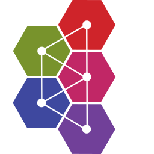
queue|nats.png|
queue|kafka.png|
queue|rabbitmq.png|
cd|tekton-cli.png|
cd|tekton.png|
cd|spinnaker.png|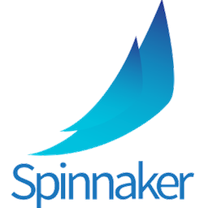
gitops|flagger.png|
gitops|argocd.png|
gitops|flux.png|
monitoring|prometheus.png|
monitoring|prometheus-operator.png|
monitoring|sentry.png|
monitoring|thanos.png|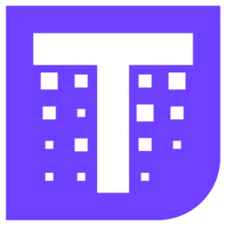
monitoring|cortex.png|
monitoring|zabbix.png|
monitoring|grafana.png|
monitoring|splunk.png|
monitoring|datadog.png|
dns|powerdns.png|
dns|coredns.png|
client|user.png|
client|users.png|
client|client.png|
logging|syslog-ng.png|
logging|fluentbit.png|
logging|rsyslog.png|
logging|loki.png|
logging|graylog.png|
analytics|dbt.png|
analytics|tableau.png|
analytics|databricks.png|
analytics|beam.png|
analytics|flink.png|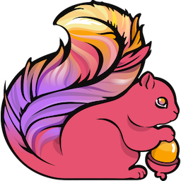
analytics|spark.png|
analytics|metabase.png|
analytics|singer.png|
analytics|hadoop.png|
analytics|hive.png|
analytics|norikra.png|
analytics|storm.png|
