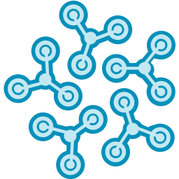

# onprem

Namespace | Name | Icon
--|--|--
diagram.onprem.database.influxdb|Influxdb|
diagram.onprem.database.clickhouse|Clickhouse|
diagram.onprem.database.janusgraph|Janusgraph|
diagram.onprem.database.cockroachdb|Cockroachdb|
diagram.onprem.database.oracle|Oracle|
diagram.onprem.database.hbase|Hbase|
diagram.onprem.database.druid|Druid|
diagram.onprem.database.postgresql|Postgresql|
diagram.onprem.database.neo4j|Neo4j|
diagram.onprem.database.cassandra|Cassandra|
diagram.onprem.database.scylla|Scylla|
diagram.onprem.database.mysql|Mysql|
diagram.onprem.database.couchdb|Couchdb|
diagram.onprem.database.couchbase|Couchbase|
diagram.onprem.database.mssql|Mssql|
diagram.onprem.database.dgraph|Dgraph|
diagram.onprem.database.mongodb|Mongodb|
diagram.onprem.database.mariadb|Mariadb|
diagram.onprem.tracing.jaeger|Jaeger|
diagram.onprem.identity.dex|Dex|
diagram.onprem.security.vault|Vault|
diagram.onprem.security.trivy|Trivy|
diagram.onprem.auth.oauth2-proxy|Oauth2Proxy|
diagram.onprem.auth.buzzfeed-sso|BuzzfeedSso|
diagram.onprem.proxmox.pve|Pve|
diagram.onprem.ci.gitlabci|Gitlabci|
diagram.onprem.ci.teamcity|Teamcity|
diagram.onprem.ci.concourseci|Concourseci|
diagram.onprem.ci.zuulci|Zuulci|
diagram.onprem.ci.droneci|Droneci|
diagram.onprem.ci.circleci|Circleci|
diagram.onprem.ci.jenkins|Jenkins|
diagram.onprem.ci.github-actions|GithubActions|
diagram.onprem.ci.travisci|Travisci|
diagram.onprem.etl.embulk|Embulk|
diagram.onprem.mlops.polyaxon|Polyaxon|
diagram.onprem.aggregator.fluentd|Fluentd|
diagram.onprem.aggregator.vector|Vector|
diagram.onprem.network.internet|Internet|
diagram.onprem.network.powerdns|Powerdns|
diagram.onprem.network.envoy|Envoy|
diagram.onprem.network.pfsense|Pfsense|
diagram.onprem.network.kong|Kong|
diagram.onprem.network.etcd|Etcd|
diagram.onprem.network.opnsense|Opnsense|
diagram.onprem.network.jbossas|Jbossas|
diagram.onprem.network.wildfly|Wildfly|
diagram.onprem.network.istio|Istio|
diagram.onprem.network.bind-9|Bind9|
diagram.onprem.network.pomerium|Pomerium|
diagram.onprem.network.vyos|Vyos|
diagram.onprem.network.haproxy|Haproxy|
diagram.onprem.network.apache|Apache|
diagram.onprem.network.open-service-mesh|OpenServiceMesh|
diagram.onprem.network.zookeeper|Zookeeper|
diagram.onprem.network.nginx|Nginx|
diagram.onprem.network.tomcat|Tomcat|
diagram.onprem.network.ocelot|Ocelot|
diagram.onprem.network.jetty|Jetty|
diagram.onprem.network.gunicorn|Gunicorn|
diagram.onprem.network.glassfish|Glassfish|
diagram.onprem.network.traefik|Traefik|
diagram.onprem.network.linkerd|Linkerd|
diagram.onprem.network.caddy|Caddy|
diagram.onprem.network.consul|Consul|
diagram.onprem.certificates.lets-encrypt|LetsEncrypt|
diagram.onprem.certificates.cert-manager|CertManager|
diagram.onprem.storage.ceph|Ceph|
diagram.onprem.storage.glusterfs|Glusterfs|
diagram.onprem.storage.ceph-osd|CephOsd|
diagram.onprem.inmemory.aerospike|Aerospike|
diagram.onprem.inmemory.hazelcast|Hazelcast|
diagram.onprem.inmemory.redis|Redis|
diagram.onprem.inmemory.memcached|Memcached|
diagram.onprem.search.solr|Solr|
diagram.onprem.container.rkt|Rkt|
diagram.onprem.container.docker|Docker|
diagram.onprem.container.gvisor|Gvisor|
diagram.onprem.container.lxc|Lxc|
diagram.onprem.container.containerd|Containerd|
diagram.onprem.container.crio|Crio|
diagram.onprem.container.firecracker|Firecracker|
diagram.onprem.iac.atlantis|Atlantis|
diagram.onprem.iac.awx|Awx|
diagram.onprem.iac.ansible|Ansible|
diagram.onprem.iac.terraform|Terraform|
diagram.onprem.compute.server|Server|
diagram.onprem.compute.nomad|Nomad|
diagram.onprem.vcs.git|Git|
diagram.onprem.vcs.github|Github|
diagram.onprem.vcs.gitlab|Gitlab|
diagram.onprem.workflow.kubeflow|Kubeflow|
diagram.onprem.workflow.airflow|Airflow|
diagram.onprem.workflow.nifi|Nifi|
diagram.onprem.workflow.digdag|Digdag|
diagram.onprem.queue.zeromq|Zeromq|
diagram.onprem.queue.celery|Celery|
diagram.onprem.queue.activemq|Activemq|
diagram.onprem.queue.nats|Nats|
diagram.onprem.queue.kafka|Kafka|
diagram.onprem.queue.rabbitmq|Rabbitmq|
diagram.onprem.cd.tekton-cli|TektonCli|
diagram.onprem.cd.tekton|Tekton|
diagram.onprem.cd.spinnaker|Spinnaker|
diagram.onprem.gitops.flagger|Flagger|
diagram.onprem.gitops.argocd|Argocd|
diagram.onprem.gitops.flux|Flux|
diagram.onprem.monitoring.prometheus|Prometheus|
diagram.onprem.monitoring.prometheus-operator|PrometheusOperator|
diagram.onprem.monitoring.sentry|Sentry|
diagram.onprem.monitoring.thanos|Thanos|
diagram.onprem.monitoring.cortex|Cortex|
diagram.onprem.monitoring.zabbix|Zabbix|
diagram.onprem.monitoring.grafana|Grafana|
diagram.onprem.monitoring.splunk|Splunk|
diagram.onprem.monitoring.datadog|Datadog|
diagram.onprem.dns.powerdns|Powerdns|
diagram.onprem.dns.coredns|Coredns|
diagram.onprem.client.user|User|
diagram.onprem.client.users|Users|
diagram.onprem.client.client|Client|
diagram.onprem.logging.syslog-ng|SyslogNg|
diagram.onprem.logging.fluentbit|Fluentbit|
diagram.onprem.logging.rsyslog|Rsyslog|
diagram.onprem.logging.loki|Loki|
diagram.onprem.logging.graylog|Graylog|
diagram.onprem.analytics.dbt|Dbt|
diagram.onprem.analytics.tableau|Tableau|
diagram.onprem.analytics.databricks|Databricks|
diagram.onprem.analytics.beam|Beam|
diagram.onprem.analytics.flink|Flink|
diagram.onprem.analytics.spark|Spark|
diagram.onprem.analytics.metabase|Metabase|
diagram.onprem.analytics.singer|Singer|
diagram.onprem.analytics.hadoop|Hadoop|
diagram.onprem.analytics.hive|Hive|
diagram.onprem.analytics.norikra|Norikra|
diagram.onprem.analytics.storm|Storm|
