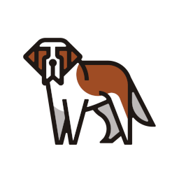

# openstack

Namespace | Name | Icon
--|--|--
diagram.resources.openstack|Openstack|
diagram.openstack.frontend|Horizon|
diagram.openstack.applicationlifecycle|Solum|
diagram.openstack.applicationlifecycle|Masakari|
diagram.openstack.applicationlifecycle|Murano|
diagram.openstack.applicationlifecycle|Freezer|
diagram.openstack.networking|Designate|
diagram.openstack.networking|Octavia|
diagram.openstack.networking|Neutron|
diagram.openstack.baremetal|Ironic|
diagram.openstack.baremetal|Cyborg|
diagram.openstack.user|Openstackclient|
diagram.openstack.storage|Manila|
diagram.openstack.storage|Swift|
diagram.openstack.storage|Cinder|
diagram.openstack.compute|Zun|
diagram.openstack.compute|Qinling|
diagram.openstack.compute|Nova|
diagram.openstack.workloadprovisioning|Magnum|
diagram.openstack.workloadprovisioning|Trove|
diagram.openstack.workloadprovisioning|Sahara|
diagram.openstack.orchestration|Mistral|
diagram.openstack.orchestration|Blazar|
diagram.openstack.orchestration|Zaqar|
diagram.openstack.orchestration|Heat|
diagram.openstack.orchestration|Senlin|
diagram.openstack.sharedservices|Keystone|
diagram.openstack.sharedservices|Karbor|
diagram.openstack.sharedservices|Searchlight|
diagram.openstack.sharedservices|Barbican|
diagram.openstack.sharedservices|Glance|
diagram.openstack.apiproxies|Ec2api|
diagram.operations.optimization|Watcher|
diagram.operations.optimization|Vitrage|
diagram.operations.optimization|Rally|
diagram.operations.optimization|Congress|
diagram.operations.multiregion|Tricircle|
diagram.operations.monitoring|Telemetry|
diagram.operations.monitoring|Monasca|
diagram.operations.billing|Cloudkitty|
diagram.lifecyclemanagement.packaging|Loci|
diagram.lifecyclemanagement.packaging|Rpm|
diagram.lifecyclemanagement.packaging|Puppet|
diagram.lifecyclemanagement.deployment|Helm|
diagram.lifecyclemanagement.deployment|Chef|
diagram.lifecyclemanagement.deployment|Kolla|
diagram.lifecyclemanagement.deployment|Charms|
diagram.lifecyclemanagement.deployment|Tripleo|
diagram.lifecyclemanagement.deployment|Ansible|
diagram.adjacentenablers.containerservices|Kuryr|
diagram.adjacentenablers.nfv|Tacker|
