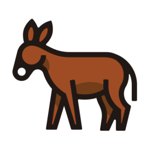

# openstack

Namespace | Name | Icon
--|--|--
diagram.openstack.openstack.png|
diagram.openstack.frontend.horizon.png|
diagram.openstack.applicationlifecycle.solum.png|
diagram.openstack.applicationlifecycle.masakari.png|
diagram.openstack.applicationlifecycle.murano.png|
diagram.openstack.applicationlifecycle.freezer.png|
diagram.openstack.networking.designate.png|
diagram.openstack.networking.octavia.png|
diagram.openstack.networking.neutron.png|
diagram.openstack.baremetal.ironic.png|
diagram.openstack.baremetal.cyborg.png|
diagram.openstack.user.openstackclient.png|
diagram.openstack.storage.manila.png|
diagram.openstack.storage.swift.png|
diagram.openstack.storage.cinder.png|
diagram.openstack.compute.zun.png|
diagram.openstack.compute.qinling.png|
diagram.openstack.compute.nova.png|
diagram.openstack.workloadprovisioning.magnum.png|
diagram.openstack.workloadprovisioning.trove.png|
diagram.openstack.workloadprovisioning.sahara.png|
diagram.openstack.orchestration.mistral.png|
diagram.openstack.orchestration.blazar.png|
diagram.openstack.orchestration.zaqar.png|
diagram.openstack.orchestration.heat.png|
diagram.openstack.orchestration.senlin.png|
diagram.openstack.sharedservices.keystone.png|
diagram.openstack.sharedservices.karbor.png|
diagram.openstack.sharedservices.searchlight.png|
diagram.openstack.sharedservices.barbican.png|
diagram.openstack.sharedservices.glance.png|
diagram.openstack.apiproxies.ec2api.png|
diagram.openstack.operations.optimization.watcher.png|
diagram.openstack.operations.optimization.vitrage.png|
diagram.openstack.operations.optimization.rally.png|
diagram.openstack.operations.optimization.congress.png|
diagram.openstack.operations.multiregion.tricircle.png|
diagram.openstack.operations.monitoring.telemetry.png|
diagram.openstack.operations.monitoring.monasca.png|
diagram.openstack.operations.billing.cloudkitty.png|
diagram.openstack.lifecyclemanagement.packaging.loci.png|
diagram.openstack.lifecyclemanagement.packaging.rpm.png|
diagram.openstack.lifecyclemanagement.packaging.puppet.png|
diagram.openstack.lifecyclemanagement.deployment.helm.png|
diagram.openstack.lifecyclemanagement.deployment.chef.png|
diagram.openstack.lifecyclemanagement.deployment.kolla.png|
diagram.openstack.lifecyclemanagement.deployment.charms.png|
diagram.openstack.lifecyclemanagement.deployment.tripleo.png|
diagram.openstack.lifecyclemanagement.deployment.ansible.png|
diagram.openstack.adjacentenablers.containerservices.kuryr.png|
diagram.openstack.adjacentenablers.nfv.tacker.png|
