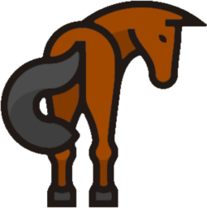
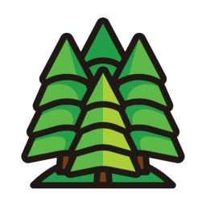
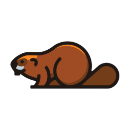
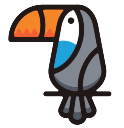

openstack

Type | Name | Icon
--|--|--
openstack|openstack.png|
frontend|horizon.png|
applicationlifecycle|solum.png|
applicationlifecycle|masakari.png|
applicationlifecycle|murano.png|
applicationlifecycle|freezer.png|
networking|designate.png|
networking|octavia.png|
networking|neutron.png|
baremetal|ironic.png|
baremetal|cyborg.png|
user|openstackclient.png|
storage|manila.png|
storage|swift.png|
storage|cinder.png|
compute|zun.png|
compute|qinling.png|
compute|nova.png|
workloadprovisioning|magnum.png|
workloadprovisioning|trove.png|
workloadprovisioning|sahara.png|
orchestration|mistral.png|
orchestration|blazar.png|
orchestration|zaqar.png|
orchestration|heat.png|
orchestration|senlin.png|
sharedservices|keystone.png|
sharedservices|karbor.png|
sharedservices|searchlight.png|
sharedservices|barbican.png|
sharedservices|glance.png|
apiproxies|ec2api.png|
optimization|watcher.png|
optimization|vitrage.png|
optimization|rally.png|
optimization|congress.png|
multiregion|tricircle.png|
monitoring|telemetry.png|
monitoring|monasca.png|
billing|cloudkitty.png|
packaging|loci.png|
packaging|rpm.png|
packaging|puppet.png|
deployment|helm.png|
deployment|chef.png|
deployment|kolla.png|
deployment|charms.png|
deployment|tripleo.png|
deployment|ansible.png|
containerservices|kuryr.png|
nfv|tacker.png|
