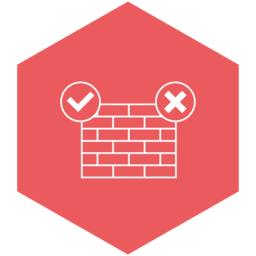
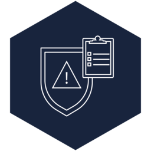
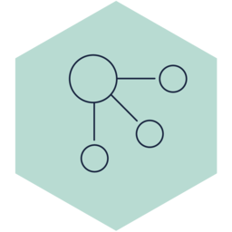
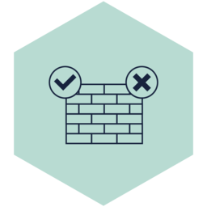
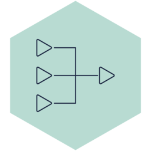
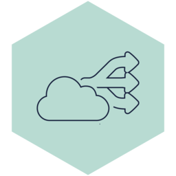
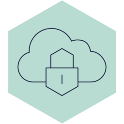
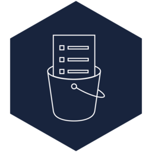
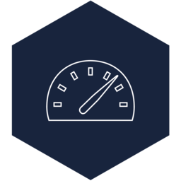

# outscale

Namespace | Name | Icon
--|--|--
diagram.outscale.security.firewall|Firewall|
diagram.outscale.security.identity-and-access-management|IdentityAndAccessManagement|
diagram.outscale.network.site-to-site-vpng|SiteToSiteVpng|
diagram.outscale.network.load-balancer|LoadBalancer|
diagram.outscale.network.net|Net|
diagram.outscale.network.nat-service|NatService|
diagram.outscale.network.internet-service|InternetService|
diagram.outscale.network.client-vpn|ClientVpn|
diagram.outscale.storage.simple-storage-service|SimpleStorageService|
diagram.outscale.storage.storage|Storage|
diagram.outscale.compute.compute|Compute|
diagram.outscale.compute.direct-connect|DirectConnect|
