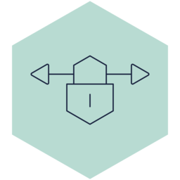

outscale

Type | Name | Icon
--|--|--
security|firewall.png|
security|identity-and-access-management.png|
network|site-to-site-vpng.png|
network|load-balancer.png|
network|net.png|
network|nat-service.png|
network|internet-service.png|
network|client-vpn.png|
storage|simple-storage-service.png|
storage|storage.png|
compute|compute.png|
compute|direct-connect.png|
