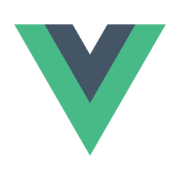
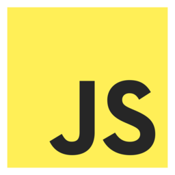

# programming

Namespace | Name | Icon
--|--|--
diagram.programming.framework.flask.png|
diagram.programming.framework.backbone.png|
diagram.programming.framework.flutter.png|
diagram.programming.framework.angular.png|
diagram.programming.framework.vue.png|
diagram.programming.framework.spring.png|
diagram.programming.framework.django.png|
diagram.programming.framework.ember.png|
diagram.programming.framework.react.png|
diagram.programming.framework.rails.png|
diagram.programming.framework.laravel.png|
diagram.programming.language.erlang.png|
diagram.programming.language.python.png|
diagram.programming.language.ruby.png|
diagram.programming.language.cpp.png|
diagram.programming.language.bash.png|
diagram.programming.language.java.png|
diagram.programming.language.rust.png|
diagram.programming.language.javascript.png|
diagram.programming.language.matlab.png|
diagram.programming.language.go.png|
diagram.programming.language.csharp.png|
diagram.programming.language.swift.png|
diagram.programming.language.c.png|
diagram.programming.language.typescript.png|
diagram.programming.language.php.png|
diagram.programming.language.dart.png|
diagram.programming.language.r.png|
diagram.programming.language.kotlin.png|
diagram.programming.language.elixir.png|
diagram.programming.language.nodejs.png|
