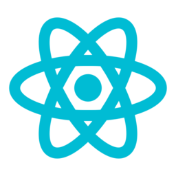
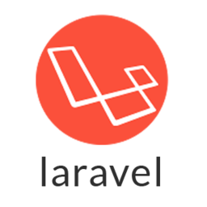

# programming

Namespace | Name | Icon
--|--|--
diagram.programming.framework|Flask|
diagram.programming.framework|Backbone|
diagram.programming.framework|Flutter|
diagram.programming.framework|Angular|
diagram.programming.framework|Vue|
diagram.programming.framework|Spring|
diagram.programming.framework|Django|
diagram.programming.framework|Ember|
diagram.programming.framework|React|
diagram.programming.framework|Rails|
diagram.programming.framework|Laravel|
diagram.programming.language|Erlang|
diagram.programming.language|Python|
diagram.programming.language|Ruby|
diagram.programming.language|Cpp|
diagram.programming.language|Bash|
diagram.programming.language|Java|
diagram.programming.language|Rust|
diagram.programming.language|Javascript|
diagram.programming.language|Matlab|
diagram.programming.language|Go|
diagram.programming.language|Csharp|
diagram.programming.language|Swift|
diagram.programming.language|C|
diagram.programming.language|Typescript|
diagram.programming.language|Php|
diagram.programming.language|Dart|
diagram.programming.language|R|
diagram.programming.language|Kotlin|
diagram.programming.language|Elixir|
diagram.programming.language|Nodejs|
