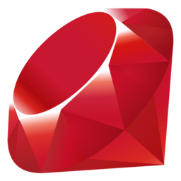
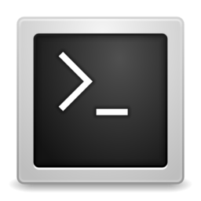

programming

Type | Name | Icon
--|--|--
framework|flask.png|
framework|backbone.png|
framework|flutter.png|
framework|angular.png|
framework|vue.png|
framework|spring.png|
framework|django.png|
framework|ember.png|
framework|react.png|
framework|rails.png|
framework|laravel.png|
language|erlang.png|
language|python.png|
language|ruby.png|
language|cpp.png|
language|bash.png|
language|java.png|
language|rust.png|
language|javascript.png|
language|matlab.png|
language|go.png|
language|csharp.png|
language|swift.png|
language|c.png|
language|typescript.png|
language|php.png|
language|dart.png|
language|r.png|
language|kotlin.png|
language|elixir.png|
language|nodejs.png|
