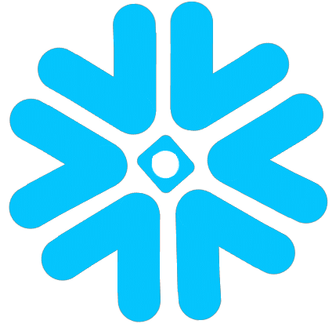

# saas

Namespace | Name | Icon
--|--|--
`diagram.saas.alerting`|Opsgenie|
`diagram.saas.alerting`|Pushover|
`diagram.saas.recommendation`|Recombee|
`diagram.saas.identity`|Okta|
`diagram.saas.identity`|Auth0|
`diagram.saas.chat`|Telegram|
`diagram.saas.chat`|Mattermost|
`diagram.saas.chat`|RocketChat|
`diagram.saas.chat`|Slack|
`diagram.saas.chat`|Discord|
`diagram.saas.chat`|Teams|
`diagram.saas.social`|Twitter|
`diagram.saas.social`|Facebook|
`diagram.saas.cdn`|Akamai|
`diagram.saas.cdn`|Cloudflare|
`diagram.saas.logging`|Datadog|
`diagram.saas.logging`|Papertrail|
`diagram.saas.analytics`|Snowflake|
`diagram.saas.analytics`|Stitch|
`diagram.saas.media`|Cloudinary|
